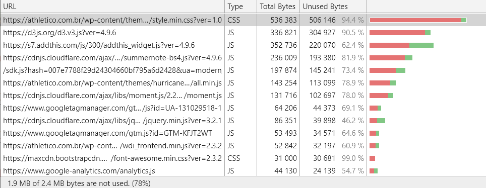
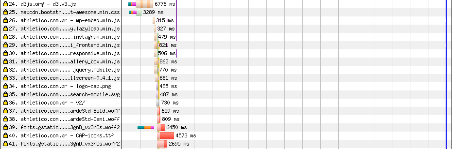
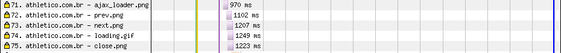

# Athletico

[Site](https://athletico.com.br/). [WebPageTest](https://www.webpagetest.org/result/190420_Y4_e2b4cfb600a34199765515afc6d33332/).

## Primeiro tempo

Essa primeira análise vai ser um pouco mais longa que as seguintes pra que eu possa detalhar o processo de análise usado e as ferramentas. Para os demais times, vou ser mais direto, já que tudo vai estar explicado aqui.

Eu geralmente uso apenas o Chrome Dev Tools (CDT daqui em diante) e o Lighthouse pra esse tipo de análise, já que dá pra fazer tudo ali dentro, desde verificar as requisições de rede (Network), medir o uso dos recursos carregados (Coverage), identificar a execução (e possíveis gargalos) de scripts (Performance e Audits), enquanto que o Lighthouse gera um relatório bonitinho e já dá umas dicas do que pode ser melhorado além de uma estimativa de ganhos seguindo algumas práticas.

Então, pra que usar o WebPageTest? Apesar de ser possível (e até mais detalhado) fazer esse tipo de análise usando as ferramentas que eu citei acima, o WebPageTest, além de ser confiável e apresentar resultados muito próximos, gera imagens das conexões e rolos de screenshots tiradas a cada 0.5s do carregamento da página e com isso eu posso simplesmente salvar e apresentar isso pra você de uma forma muito prática. De qualquer forma, usarei algumas funcionalidades do CDT, mas vai ficar claro quando isso acontencer.

Dos testes executados acima, a mediana para a primeira visita foi a execução de número 3 e a linha do tempo da renderização é a seguinte:


**Começamos com 9.9s de nada**. Aos 10s já é possível interagir com a página, ainda que o conteúdo só comece a aparecer aos 10.9s


O primeiro problema aqui já é a segunda requisição. Nosso CSS principal, apesar de estar minificado, pesa, ironicamente, 525.8 KB! E piora. Ele vem do servidor desse jeito mesmo, **sem compressão**. A compressão (gzip), do lado do servidor, reduziria *em* 450 KB o tamanho desse arquivo. Mas como nada é tão ruim que não possa piorar, o relatório de coverage aponta que 94.4% desse arquivo **não é usado** na página inicial. No fim das contas, dos 525 KB iniciais, a página está consumindo de fato em torno de 5 KB (considerando compressão).



A solução pra isso seria ativar a compressão (gzip) no servidor e se fôssemos levar a otimização ao extremo, uma ferramenta como o [critical](https://github.com/addyosmani/critical) extrairia **só as regras necessárias para apresentar o conteúdo visível da viewport** (*above the fold*) e as aplicaria inline. Dessa forma reduziríamos uma requisição (que precisaria ser feita depois, pra completar a página, de qualquer forma) e a renderização aconteceria muito mais rapidamente.

O relatório de coverage já deu o spoiler: vários scripts sofrem do mesmo problema. O D3.js, importado direto do site da biblioteca (poderia no mínimo estar vindo de uma CDN, que já é usada para outros scrits), além de **não ser minificado** (baixa quase 70 KB enquanto poderia estar baixando 15 KB), não é usado em 90.5% de sua totalidade. A lib moment.js também é tratada da mesma forma.

Muitas vezes, esse percentual tão pequeno que é utilizado na verdade é só a inicialização e colocação de event listeners no documento, ou seja, a lib só está esperando a hora de ser chamada, mas talvez isso nem aconteça.

Pra fechar o tópico de scripts, você pode ver que eles se concentram exatamente antes das linhas verde (start render) e amarela (DOM Interactive), mais expecificamente das linhas 4 até 33. Isso não é por acaso, já que os scripts estão sendo **baixados e executados de forma síncrona**. Ou seja, estão **bloqueando a renderização**! Esse é um trecho do `head`:

```html
<script type='text/javascript' src='https://s7.addthis.com/js/300/addthis_widget.js?ver=4.9.6#pubid=wp-011be5fd79766513e808597c12d96ced'></script>
<script type='text/javascript' src='https://cdnjs.cloudflare.com/ajax/libs/jquery/3.1.0/jquery.min.js?ver=3.2.1'></script>
<script type='text/javascript' src='https://cdnjs.cloudflare.com/ajax/libs/bootstrap-3-typeahead/4.0.2/bootstrap3-typeahead.min.js'></script>
<script type='text/javascript' src='https://connect.facebook.net/pt_BR/sdk.js?ver=4.9.6'></script>
<script type='text/javascript' src='https://cdnjs.cloudflare.com/ajax/libs/popper.js/1.12.3/umd/popper.min.js?ver=4.9.6'></script>
<script type='text/javascript' src='https://cdnjs.cloudflare.com/ajax/libs/summernote/0.8.8/summernote-bs4.js?ver=4.9.6'></script>
<script type='text/javascript' src='https://d3js.org/d3.v3.js?ver=4.9.6'></script>
<script type='text/javascript' src='https://cdn.jsdelivr.net/parallax.js/1.4.2/parallax.min.js?ver=4.9.6'></script>
<script type='text/javascript' src='https://cdnjs.cloudflare.com/ajax/libs/moment.js/2.21.0/moment.js'></script>
<script type='text/javascript' src='https://cdnjs.cloudflare.com/ajax/libs/jquery.mask/1.14.15/jquery.mask.min.js?ver=4.9.6'></script>
<script type='text/javascript' src='https://athletico.com.br/wp-content/themes/hurricane/assets/js/loadmore.min.js'></script>
<script type='text/javascript' src='https://athletico.com.br/wp-includes/js/underscore.min.js?ver=1.8.3'></script>
<script type='text/javascript' src='https://athletico.com.br/wp-includes/js/backbone.min.js?ver=1.2.3'></script>
```

Esses scripts poderiam se beneficiar do atributo `defer`, que permite que eles continuem sendo **baixados com antecedência, mas evita que eles bloqueiem a renderização**. Dessa forma, a página renderiza muito antes, mas pode haver problemas em componentes que dependam de algum destes scripts. Na minha opinião, mais da metade disso tudo aí não faria falta.

Não bastasse isso, no fim do documento (o famoso "antes do fim do `body`"), tem mais uma leva de quase 10 recursos, entre CSS e JS. Eles começam a ser **baixados com 8.5s de atraso**. É bem fácil de identificar esse problema pelos "degraus" que ele cria:



A partir da linha 26 estão os scripts que o navegador descobriu só depois de ter passado por todo documento, e aí ele volta a bloquear a renderização e baixa tudo.

Mais uma vez, esses scripts poderiam se beneficiar do atributo `defer`, além de serem posicionados no `head`.

Esse trecho do degrau aí em cima traz ainda dois detalhes que eu não posso deixar de citar. O primeiro está na linha 25. Se você olhou com mais calma o relatório de coverage, viu na penúltima linha o arquivo `font-awesome.min.css`, com 99% de conteúdo não utilizado. Para o leitor não familiarizado, essa é uma **fonte de ícones**, usado aqui para os ícones: arrow-right, arrow-left e play. 9 linhas usadas de 2929 (e ainda tem o arquivo `.woff`, da fonte em si, com 75 KB). E o que me deixa confuso é que você pode ver que o site já faz download de ícones em png, como pode ser visto abaixo:



Pra fechar o primeiro tempo (já estouramos os 13 minutos de acréscimo dado), da linha 37 em diante temos o download das fontes usadas no site. Esse download atrasado, depois de tudo, acontece porque **o navegador só sabe das fontes usadas no documento depois que todo CSS foi analisado** (CSSDOM pronto) e adivinha: nós temos aqui um arquivo CSS de +500 KB para baixar e depois analisar. Isso resulta nas nossas fontes sendo baixadas a partir dos 9.7s. Para reduzir esse impacto, pode-se pré-carregar as fontes usadas no site com o atributo `rel=preload` nos `links`. Você pode ler mais a respeito do `preload` nesse [trecho bem curto de um artigo do Google](https://developers.google.com/web/fundamentals/performance/optimizing-content-efficiency/webfont-optimization?hl=pt#pre-carregar_seus_recursos_de_webfont), mas ficaria algo parecido com isso:

```html
<link rel="preload" as="font" href="...">
```

Isso já faria o browser baixar as fontes e só esperar pra ver onde colocar cada uma. Usar o formato `woff2` ainda traria [reduções de até 30%](https://groups.google.com/a/chromium.org/forum/#!topic/chromium-dev/j27Ou4RtvQI/discussion) em relação ao formato `woff` usado em algumas fontes aqui.

## Segundo tempo

A segunda visita parece com isso:


O site está com o cache funcionando perfeitamente, mas ainda assim demora **3.5s mostrando nada**, e quando mostra, fica travado (com um breve intervalo) até **6.5s** (barra vermelha - Page is Interactive - na última linha do gráfico acima). Isso acontece pois todos os scripts já estão prontos, então eles executam de uma vez só. As soluções que propus acima, carregar só os scripts necessários e usar `defer` onde possível, permitiriam renderizar antes do JS.

Permitir um mínimo de cache, algo como 5 minutos na página inicial, removeria esses 1751 ms de atraso também e não comprometeria muito as atualizações do site.

## Imagens

Falamos muito sobre scripts, CSS, bloqueio de renderização entre outras práticas, mas se você reparou no primeiro relatório de carregamento, notou que a página leva praticamente 90s para carregar completamente e que praticamente 100 requisições a partir da linha 52 são imagens. De um total de 13.8 MB transferidos, 11.7 MB são imagens.

Num plano de 100 MB a R$ 1,49/dia, acessar este site uma vez por dia custaria R$ 6,17 por mês, ou 4 dias de internet.

**Nenhuma imagem passou por compressão**, entre as servidas pelo Athletico. Entre as que foram comprimidas, estão as **trinta e quatro** de um carousel do Instagram.

Uma das imagens que servem de fundo ao slider principal e que tem a largura total da tela pesa 1.17 MB e tem 2880x1200px. Quanto às dimensões, o uma solução rápida seria servir uma imagem adequada ao mobile, com no máximo 1000px de largura. A solução ideal mesmo seria usar `srcset` e `sizes` no `img` ou `picture`s. Quanto ao peso, **reduzi o JPEG original de 1.17 MB para 44 KB (96% menor) em JPEG ou 25.8 KB em WebP**.

Em outra imagem, **reduzi o PNG original de 996 KB para 43.5 KB (96% menor) em JPEG ou 24.9 KB em WebP**.

Você pode [conferir o resultado](imgs/squoosh) dessas imagens e me dizer se dá pra notar diferença.

Fica MUITO claro o benefício da compressão de imagens, mas isso não é tudo. Reduzir o tamanho das imagens ajuda bastante, mas você não precisa carregar a imagem se o usuário não está vendo ela 🧐

Atrasar o carregamento de imagens até que elas entrem no viewport (*image lazy loading*) deveria ser sempre a primeira opção. Isso pode ser alcançado usando uma lib como o [Echo](https://github.com/toddmotto/echo) (já usei e ainda uso) ou o [Intersection Observer API](https://developer.mozilla.org/en-US/docs/Web/API/Intersection_Observer_API) que é nativo do navegador, mas ainda não tem tanta [implementação](https://caniuse.com/#search=intersection).

## Resultado

17.4s

Graças ao H, o Afhletico se mantém na ponta, com o primeiro e único resultado até o momento.

Bom
- HTTPS
- HTTP/2
- Prefetch
- Cache

Ruim
- Minificação
- Sem gzip
- Compressão de imagens
- Compressão de fontes
- JS desnecessário
- CSS desnecessário
- Fontes de ícones
- Download atrasado de JS
- Download atrasado de CSS
- Download atrasado de fontes
- Scripts bloqueiam renderização

Esse site tem muito potencial, pois as requisições já desfrutam do HTTP/2, além do cache e da segurança do HTTPS. Um ponto que não comentei antes é que alguns recursos externos ainda desfrutam de uma conexão mais rápida graças ao `dns-prefetch` de alguns domínios no `head`, como por exemplo:

```html
<link rel='dns-prefetch' href='//d3js.org' />
```

Tenho a sensação de que seria possível reduzir em uns 7s o tempo de carregamento inicial reorganizando o download e compressão dos scripts no `head`, aquele CSS imenso e as fontes de ícones.