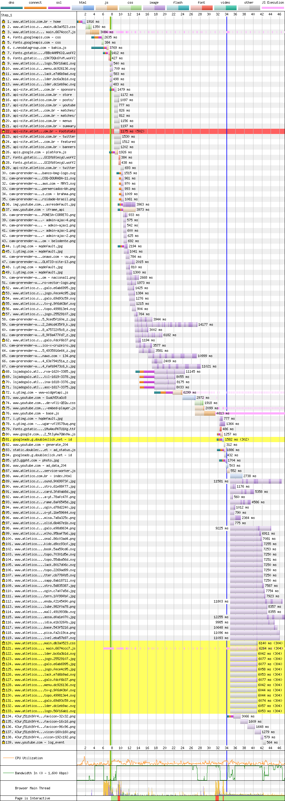
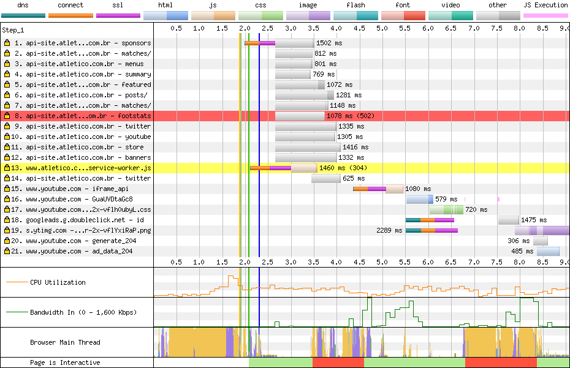

# Atletico

[Site](https://www.atletico.com.br/home). [WebPageTest](https://www.webpagetest.org/result/190422_W3_c7bc71208382393d060e62085c8ac71a/).

## Primeiro tempo


Começamos com **7.6s de nada**, e ainda que surja um pouco de cor na tela, só temos **conteúdo útil aos 10.3s**. Isso acontece pois esta página não é renderizada no servidor, como a do Athletico, e sim no cliente pelo JavaScript, que leva esse tempo pra baixar, montar a estrutura e começar a baixar o que precisa.

Vamos ao relatório da rede, que não deixa mentir:



Coincidência ou não (eu realmente estou escrevendo na ordem que você está lendo, o que te surpreende, me surpreende) o primeiro problema aqui é o CSS. Não o tamanho, até porque ele está **minificado e gzipado**, vindo em 39.9 KB, mas como está sendo usado Webpack pra fazer o bundle de tudo (você pode ver que só tem um script e um CSS principal), a viagem deveria ter sido aproveitada e essa folha de estilo ter sido dividida só pelo que **é usado nessa página, nesse caso 17.6%**. Isso ajudaria, mas não faria muuuita diferença (ok, uns 35 KB a menos). O que prejudica um pouco mais é a primeira linha desse CSS:

```css
@import url(https://fonts.googleapis.com/css?family=Roboto+Condensed:300,400,700);@import url(https://fonts.googleapis.com/css?family=Roboto:400,400i,500);
```

Dois `imports` de fontes, que você pode ver na linha 4 e 5. É praticamente o mesmo problema do Athletico, apresentado de outra forma: **o browser só sabe dessa fonte depois que o arquivo CSS inteiro é computado.** Isso pode ser evitado adicionando essa requisição ao HTML:

```html
<link href="https://fonts.googleapis.com/css?family=Roboto+Condensed:300,400,700|Roboto:400,400i,500" rel="preload" as="font">
```

Isso resolveria o problema das fontes serem carregadas tão tarde, mas não resolveria aquela linha colorida verde, laranja e rosa que mostra o tempo negociando e conectando com o servidor onde estão estes recursos. Usando a solução que o Athletico usou, podemos solicitar ao navegador que faça o `prefetch` desses domínios, ou seja, "vai adiantando essa conexão aí que eu vou precisar dela logo":

```html
<link rel='dns-prefetch' href='//fonts.googleapis.com' />
<link rel='dns-prefetch' href='//c.neodatagroup.com' />
```

Note que eu já aproveitei e fiz o `prefetch` de outro recurso que também estava sofrendo com a conexão atrasada, na linha 7 (que chama um script `bahia.js`... vai entender)

Falando em script, nosso maior atraso se deve a ele, na linha 3. Como todo `body` é gerado no cliente, o JS foi posicionado lá no fim, isso significa que ele só será baixado e executado depois de analisado o documento inteiro. Isso pode ser melhorado, jogando esse script pro `head` com `defer`. Dessa forma ele começa a ser baixado antes e vai ser executado depois do documento pronto, da mesma forma.

Mais uma vez, o relatório de coverage me diz que **50.6% desse bundle não é usado**. Desperdício. O Webpack já tá sendo usando, é só uma questão de mandar só o que a página precisa (code split).

## Segundo tempo

Rola a conexão, começa a segunda visita...


Dessa vez temos *apenas* **2s de nada** sendo mostrado, aí entra o logo placeholder até **5s onde a interação está pronta**.



Cache OK, nenhuma requisição desperdiçada. Só acho que o Service Worker (linha 13) tá sendo usado inutilmente aqui. Geralmente usado pra apresentar algum conteúdo **útil** cacheado em estados offline, aqui ele é usado somente como placeholder. Fora o fato de que, na primeira renderização, da linha 87 em diante, tudo o que é baixado é pra alimentar o cache do SW e não serve pra nada na página atual.

## Custo

São 5.7 MB baixados (4.5 MB de imagens). Num plano de 100 MB a R$ 1,49/dia, acessar este site uma vez por dia custaria R$ 2,55 por mês, ou mais de 1 dia e meio de internet.

## Imagens

Nenhuma imagem é servida de acordo com o tamanho da tela, ou seja, no nosso teste, **uma imagem com 555 KB e 2048x1365 seria reduzida para 114 KB (80% menor) em JPEG ou 80.2 KB em WebP.**

Você pode estar pensando: mas esse cara está reduzindo o tamanho das imagens para 1000px, isso ajuda a reduzir o peso!!11 Nesse exemplo, **uma imagem com 625 KB 640x480 foi escalada para 1000px de largura e reduziu para 130 KB (80% menor) em JPEG ou 90.6 KB em WebP.**

A compressão, aliada ao carregamento atrasado das imagens (lazy load) reduziria o tamanho total em MB e o número de requisições.

[Veja os resultados](imgs/squoosh)

## Resultado

Atlético - 15.3s
Athletico - 17.4s

Temos um novo líder! Este tempo poderia ser melhor reduzindo o tamanho dos bundles do CSS e JS e pré-carregando as fontes.

Bom
- HTTPS
- HTTP/2
- gzip
- Cache
- Minificação

Ruim
- Service Worker 
- Renderizado completamente no cliente
- Compressão de imagens
- JS desnecessário
- CSS desnecessário
- Download atrasado de fontes
- Scripts bloqueiam renderização