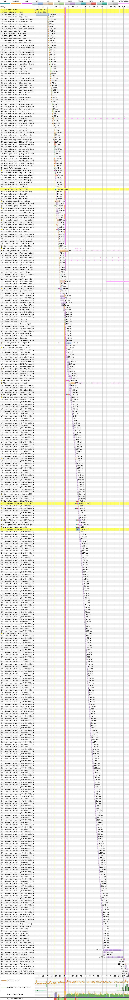
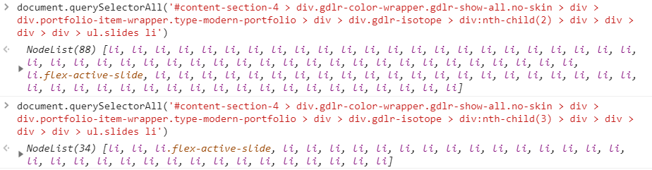
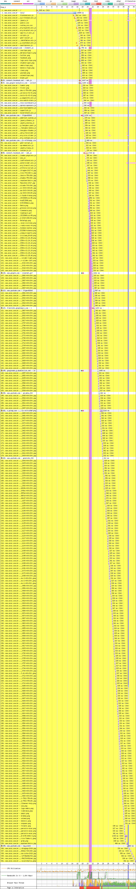

# Avaí

[Site](http://www.avai.com.br). [WebPageTest](https://www.webpagetest.org/result/190422_X3_475d396e7988a2ef43d94caba0deb738/).

## Primeiro tempo

**22.9s sem nenhum conteúdo na tela**. Não começamos muito bem por aqui. Apesar da linha amarela que indica o DOM interativo estar em 35s, **a thread está bloqueada até os 37s**, quando de fato é possível interagir com com o conteúdo.

Por que isso?

Em respeito a quem está lendo, escondi uma parte dos mais de 7000px de height dessa imagem. São **409 requisições**. A primeira redireciona temporariamente (302) para /novo, que redireciona permanentemente para novo/ (301), que fica **mais de 13s esperando por uma resposta do servidor**. Existe um sério problema com o servidor aqui que, sozinho, **reduziria o tempo de carregamento em 35%**.

São 47 arquivos CSS, 2 ou 3 devem estar minificados. 54 são scripts, a maioria não minificada. Exatas 300 imagens, mas isso é assunto pra depois. Todas essas requisições são feitas de forma síncrona, ou seja, **1 requisição por vez já que está sendo usado HTTP/1** aqui. Pra piorar não tem `keep-alive` nos cabeçalhos das requisições, ou seja, o servidor tá livre pra fechar a conexão com o cliente ao fim de cada requisição. Um update no servidor para HTTP/2 permitiria acelerar um pouco o processo.

As fontes também respondem por 240 KB, sendo que duas versões da fonte de ícones `fontawesome-webfont.woff` são baixadas, além das versões cyrilic, greek, vietnamese, latin e suas variações `-ext` das fontes Open Sans, Roboto, ABeeZee e Open Sans Condensed.

Trazer os scripts pro `head` com `defer` ajudaria muito com o bloqueio da renderização e traria conteúdo visível pra tela mais cedo.

Fiquei com tanta imagem sendo carregada e fui olhar a página de perto. No fim dela tem uma galeria com, aparentemente, as últimas 4 partidas do Avaí. **Cada galeria roda um slider que contém TODAS as fotos do jogo.** A imagem abaixo não me deixa perder a conta: uma tem 88 imagens e outra 34. Tem mais duas ainda...

Eu poderia ser radical e dizer que só uma thumbnail de capa pra cada galeria já seria suficiente, mas vamos deixar umas 5, só pra aproveitar o slider. Resolve 95% do problema com imagens.

## Segundo tempo

**Tela branca até 16.6s** graças a 13.2s esperando o servidor dar um sinal. A página **só fica interativa aí por 24.6s**, quando a thread principal é liberada.

Como **não há cache**, o navegador dá uma mão e verifica que nada mudou, então não precisa baixar de novo, mas de qualquer forma perdemos tempo com cada requisição aqui, além de todos aqueles scripts rodando de uma vez só.

## Custo

São 16.4 MB baixados (13.5 MB de imagens). Num plano de 100 MB a R$ 1,49/dia, acessar este site uma vez por dia custaria R$ 7,33 por mês, praticamente 5 dias de internet.

## Imagens

A imagem do cabeçalho mede 1600x820px e tem 3.06 MB, ficaria com **136 KB (96% menor) em JPEG ou 115 KB em WebP.**

Selecionei essa segunda imagem e não vou redimensionar para 1000px, vai ficar original, apenas para demonstrar o ganho, mesmo com uma péssima prática. A imagem se chama *Captura-de-Tela-2019-03-26-às-13.24.14* tem 237x401px e 83.3 KB. Comprimida passaria a ter 11.1 KB (87% menor) em JPEG ou 6.93 KB em WebP.

A compressão ajudaria muito a reduzir o tamanho total do site, mas tão importante quanto isso seria reduzir a **quantidade** de imagens usadas.

[Veja os resultados](imgs/squoosh)

## Resultado

1. Atlético - 15.3s
1. Athletico - 17.4s
1. Avaí - 61.6s

Só analisei estes 3 times até agora, mas aposto que essa vai ser a melhor posição do Avaí nessa tabela. **Resolver apenas o problema inicial do servidor já reduziria 26s desse tempo.**

Bom
- Carregou

Ruim
- Sem keep alive
- Sem cache
- Sem minificação
- Sem gzip
- HTTP/1
- HTTP
- Compressão de imagens
- JS desnecessário
- CSS desnecessário
- Fontes desnecessárias
- Fontes de ícones
- Download atrasado de JS
- Download atrasado de CSS
- Download atrasado de fontes
- Scripts bloqueiam renderização
- Excesso de requisições
- Muitas imagens