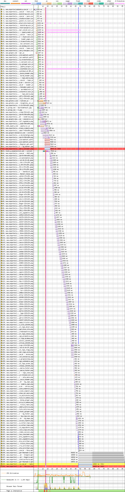

# Bahia

[Site](https://www.esporteclubebahia.com.br/). [WebPageTest](https://www.webpagetest.org/result/190422_WW_4f02fcf7f5e68dc4ebd3398f2d3d3571/).

## Primeiro tempo

Somos recebidos por **4.9s de tela branca** e pelos próximos **48.3s**, tudo o que vemos é o logo no header e um fundo de torcida. Será que queimei a língua falando do Avaí?

Eu vi antes este relatório e depois as imagens do carregamento e confesso que estava muito empolgado. Conexões simultâneas graças ao HTTP/2, gzip, HTTPS, tudo cacheado, a linha rosa na vertical que mostra o `DOMContentLoaded` entre 10 e 15s, parecia que teríamos uma boa surpresa, mas eu me enganei.

Me surpreendeu o WebPageTest não marcar em vermelho lá embaixo onde diz "Page is Interactive", pois a thread está bloqueada (por isso prefiro o CDT pra análises sérias) até os 48s pelo JS das linhas 10, 11 e 27, principalmente. Isso fica muito claro pelos traços rosa na horizontal. Note que são **traços**. Acaba por parecer uma linha de tamanho o trabalho que está sendo executado.

Rodando o JavaScript Profiler do CDT no desktop, sem emular uma conexão e CPU de celular, mostra o responsável pelo problema (proporcionalmente o problema é o mesmo). O plugin do jQuery `mCustomScrollbar` analisa e repinta o DOM MUITAS vezes e não por acaso isso acontece logo depois do `DOMContentLoaded`, afinal deve ter algum script esperando pelo `ready` pra começar a executar uma função. A ideia de alterar o comportamento padrão do scroll resultou na thread parada por 40s. Se tem uma coisa que me incomoda é o scroll do mouse não se comportar **da mesma forma que no resto da internet inteira**. Dou uma volta no scroll e já estou no fim da página.

A solução milagrosa que vai fazer esse site ficar 40s mais rápido (*REMOVI ESSE SCRIPT E MEU SITE FICOU 1 MINUTO MAIS RÁPIDO - VOCÊ VAI FICAR CHOCADO*) é tirar esse script. Resolve a performance e a usabilidade.

CSS e scripts, em grande parte, **não estão minificados** e, de modo geral, 74% nem é usado. Code splitting aqui reduziria em 1.4 MB o código carregado na página segundo o relatório de coverage. As fontes, ainda que estejam num arquivo só delas (`font.css`, linha 2), o que permite que o navegador saiba de antemão onde elas estão, não adianta o download, que poderia ser resolvido com `preload`. Todos os scripts estão no `head`, com exceção de 1, e poderiam se beneficiar do `defer`.

## Segundo tempo

**Tela branca até os 3s** e interatividade aos 8.3s, mas **como não há conteúdo ainda, considero 8.5s**.

Cache OK, poderia cachear as mídias de áudio mp3 também. O mesmo problema do **script bloqueando massivamente o render** se repete aqui.

## Custo

São 8.5 MB baixados (7.8 MB de imagens). Num plano de 100 MB a R$ 1,49/dia, acessar este site uma vez por dia custaria R$ 3,80 por mês, 2 dias e meio de internet.

## Imagens

O banner que fica no fundo do header é uma imagem de 2560x805px com 339 KB, **fica com 26.2 KB em JPEG (92% menor) ou 12.8 KB em WebP.**

O logo do clube, que é repetido no site em 3 versões de tamanhos diferentes, mede 1374x1660px com 303 KB, **passaria a 93.9 KB em PNG (69% menor) ou 36.1 KB em WebP**, reduzindo para as mesmas dimensões fixas usadas no site, de 400px. [Veja os resultados](imgs/squoosh).

Como dito acima, dos 8.5 MB baixados, apenas 700 KB não são de imagens, que são 159 no total. **Compressão e lazy loading** resolveriam muita coisa.

## Resultado

- Atlético - 15.3s
- Athletico - 17.4s
- Bahia - 56.8s
- Avaí - 61.6s

É como se o Bahia contratasse o Messi e colocasse ele aos 40" do segundo tempo na lateral esquerda. Este site tem muito potencial e uma base muito sólida, mas um script tirou pelo menos 40s do carregamento dele. O que eu falei acima ajudaria em todos os setores, mas remover esse comportamento alterado do scroll já colocaria o Bahia brigando pela primeira colocação. Uma pena.

Bom
- HTTP/2
- HTTPS
- gzip
- Cache

Ruim
- Minificação
- Compressão de imagens
- JS desnecessário
- CSS desnecessário
- Download atrasado de fontes
- Scripts bloqueiam renderização
- Muitas imagens