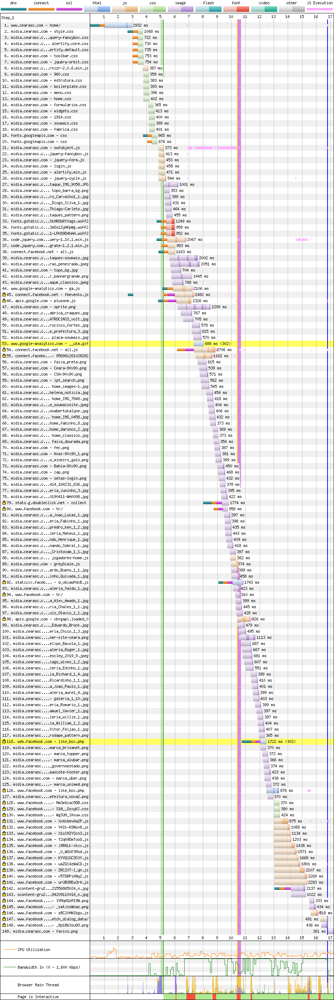
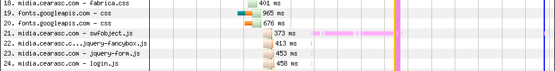
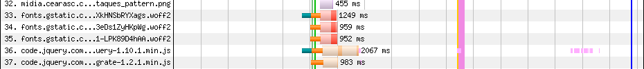
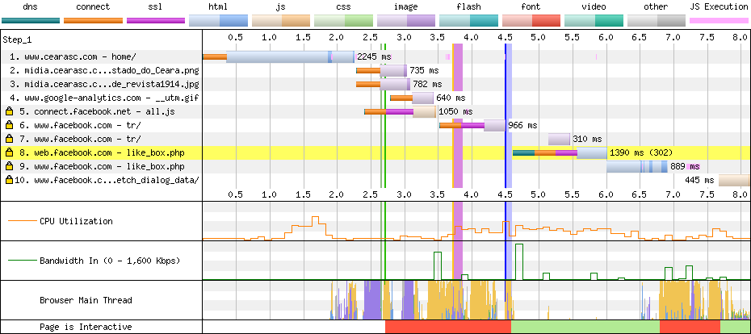

# Ceará

[Site](http://www.cearasc.com/home/). [WebPageTest](https://www.webpagetest.org/result/190422_J7_ca152e955d92072127226d2a92f2eb59/).

## Primeiro tempo


**Uma tela em branco nos recebe e dura 5.1s**. Em 10.4s o site está interativo, apesar de **não ser responsivo**.



**3s é o tempo que o servidor demora para responder** à primeira requisição. Quando responde, recebemos nossos arquivos **sem minificação, porém gzipados**.

O HTTP/1 atrapalha, já que tudo precisa ser baixado em sequência, enquanto que o primeiro CSS `style.css` joga lenha na fogueira:

```css
@import url('boilerplate.css');
@import url('960.css');
@import url(http://fonts.googleapis.com/css?family=Arvo:400,700);
@import url(http://fonts.googleapis.com/css?family=Droid+Sans:400,700);
@import url('estrutura.css');
@import url('menu.css');
@import url('home.css');
@import url('formularios.css');
@import url('widgets.css');
@import url('1914.css');
@import url('soumais.css');
@import url('fabrica.css');
```

Com isso, o CSS é analisado por inteiro, o documento volta a fazer o que é sua prioridade, que é baixar e executar o que está no HTML e você volta a ver estes arquivos sendo baixados a partir da linha 9, depois de todo o resto que está no `head` ser baixado. A solução pra isso, como vimos em outros casos, seria consolidar todos os arquivos em um ou separar as requisições no próprio HTML, cada um com seu `link`. Isso, é claro, depois de **remover o que não é usado, que juntando CSS e JS totaliza 66%** do que é baixado.



Terminado de baixar o CSS avulso, o navegador parte para baixar e executar o resto dos scripts que estão no fim do `body` e lá encontramos o responsável por atrasar a renderização, na linha 21, que **bloqueia o render por mais de 3s**. Colocar todos os scripts no `head` e utilizar o `defer` ajudaria a evitar casos como este.



Mais pra baixo, nossas fontes são carregadas com muito atraso, o que poderia ser evitado com o `preload` e a intenção explícita do download delas em um `link` ao invés de escondidas num CSS.

## Segundo tempo


Ainda que tenhamos conteúdo na tela em 3.4s, **a thread está bloqueada até os 4.5s**.



Como o cache está fazendo o seu trabalho, não há muito trabalho a ser feito na segunda visita. Mesmo assim, o servidor demora a responder e compromete em 2.2s o tempo de resposta.  Os scripts de antes voltam a atacar a renderização aqui e esses dois problemas são os responsáveis pela maior parte desse tempo todo, que não chega a ser muito, mas poderia ser bem menor.

## Custo

São 3.6 MB baixados (1.6 MB de imagens). Este é o menor site até agora. Num plano de 100 MB a R$ 1,49/dia, acessar este site uma vez por dia custaria R$ 1,61 por mês, praticamente 1 dia de internet.

## Imagens

Nenhuma imagem neste site tem mais do que 69.7 KB, e isso inclui um banner de 1600px de largura. É perceptível o trabalho de compressão de imagens.

Ainda assim, **o banner de 1600x327px e 69.7 KB, teria 23.7 KB em JPEG (66% menor) ou 16.2 KB em WebP**. Lembre-se que estou redimensionando para 1000px, afinal, estamos no mobile.

Queria muito encontrar um sprite e achei aqui, ele tem 569x290px e 66 KB, teria 65.2 KB em PNG *(1% menor)* ou 39.7 KB em WebP.

[Veja os resultados](imgs/squoosh).

## Resultado

- Ceará - 14.9s *
- Atlético - 15.3s
- Athletico - 17.4s
- Botafogo - 28s *
- Bahia - 56.8s
- Avaí - 61.6s

* Não é responsivo

Uma versão mobile desse site, só com minificação, HTTP/2, um tempo de resposta melhor do servidor e `defer` reduziria esse tempo em uns 5s tranquilamente. A grande responsável por esse tempo é a compressão das 91 imagens, não tenho dúvidas. Uma melhor configuração de servidor e scripts não bloqueando a renderização, esse tempo baixaria em mais 4s! Em um site de 2010...

Bom
- Cache
- gzip
- Compressão de imagens

Ruim
- HTTP
- HTTP/1
- Sem minificação
- JS desnecessário
- CSS desnecessário
- Download atrasado de fontes
- Scripts bloqueiam renderização
- Não é responsivo