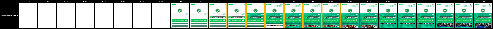
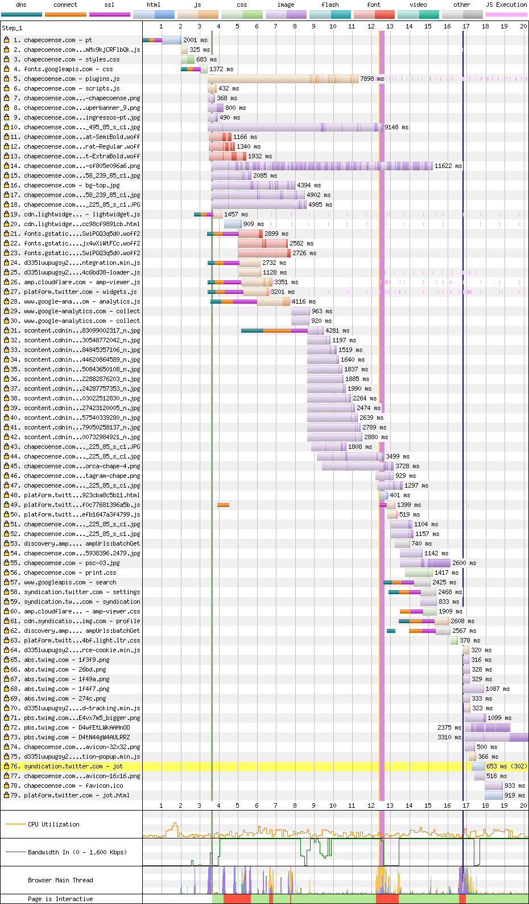
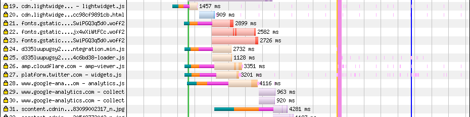
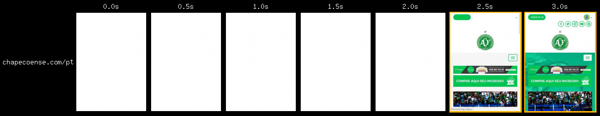
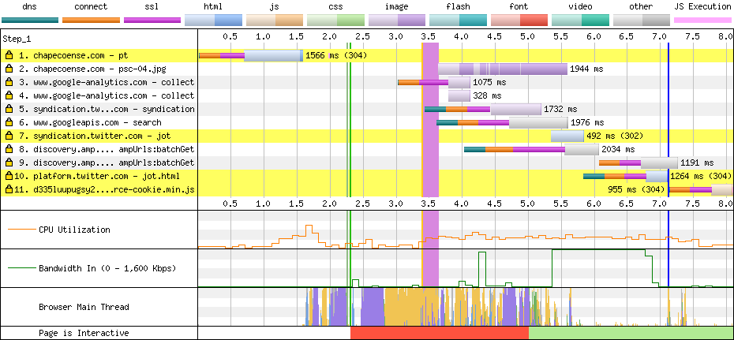

# Chapecoense

[Site](https://chapecoense.com/pt). [WebPageTest](https://www.webpagetest.org/result/190422_AP_9adfdc13c780b0456cb059a42ba25426/).

## Primeiro tempo

Começamos com **3.6s de nada na tela**. Ainda que o conteúdo comece a aparecer em seguida, a interatividade com a página está bloqueada por um script até 13.4s.

O responsável por esse atraso na interatividade é em grande parte o script da linha 5. Analisando o conteúdo dele, descobri que **ele contém 12 outros scripts**, de jQuery a lazy load, que após o download (que demora) são todos executados (mas **apenas 38.1% é usado**). Além disso, todos os scripts estão localizados no fim do `body`. Inclusive um deles, lá no fim, usa o atributo `async`, só que `async` no fim da página tem o mesmo efeito que `defer` no começo. Ou seja, a solução aqui seria, primeiro, dividir esse script imenso em arquivos individuais, trazer todos pro `head` e usar o `defer`. Essa divisão em vários arquivos **se beneficiaria do fato do site usar HTTP/2**.

Infelizmente **o site não faz uso de gzip**, o que afeta a compressão de forma geral, mas chamo a atenção para as fontes. Duas famílias de fontes são usadas aqui, uma em `woff` (11, 12, 13), carregada localmente e outra em `woff2` (21, 22, 23) do Google Fonts. **As locais, sem compressão e num formato não ideal**, pesam em torno de 56 KB, enquanto as últimas aproximadamente 13 KB. Isso, aliado ao `preload` carregaria tudo com antecedência e menos dados.

Outro ponto importante é a **quantidade de conexões extras** para servidores diversos. A imagem acima é uma parte do que também ocorre próximo da linha 57. Isso acontece pois o navegador não sabe de antemão com quem ele precisa se conectar, e pode ser resolvido com `dns-prefetch`, como o Athletico fez.

O maior arquivo CSS da página **não é minificado e mais de 75% dele não é usado**.

## Segundo tempo

**Tela em branco por 2.2s**, página visualmente completa já aos 3s, mas a **thread principal fica bloqueada até os 5s**, graças àquele script que falei anteriormente.

O cache aqui faz o seu papel, mas poderia ser melhor, já que tempo dele é de apenas 4 horas. Temos uma requisição extra, na linha 2, que aparentemente é de um trecho de banner aleatório a cada visita.

Mas o grosso desse tempo mesmo são os 2.5s que a thread fica parada devido aos scripts.

## Custo

São 4.3 MB baixados (3.9 MB de imagens). Num plano de 100 MB a R$ 1,49/dia, acessar este site uma vez por dia custaria R$ 1,92 por mês, pouco mais de 1 dia de internet.

## Imagens

Este site faz uso do carregamento atrasado de imagens (lazy loading), o que reduz consideravelmente a quantidade e o peso das requisições. Note que esta página baixou apenas 79 arquivos no total!

Ainda assim, encontrei um sprite de 138x**6354**px e 898 KB, que **poderia ser reduzido a 784 KB em PNG ou 277 KB em WebP.**

O cabeçalho é composto por uma imagem de 1920x822px e 91 KB, que **seria reduzida para 23.2 KB em JPEG (75% menor) ou 11.2 KB em WebP.** 

[Veja os resultados](imgs/squoosh).

## Resultado

- Ceará - 14.9s *
- Atlético - 15.3s
- Athletico - 17.4s
- Chapecoense - 18.4s
- Botafogo - 28s *
- Bahia - 56.8s
- Avaí - 61.6s

* Não é responsivo

Só de separar aquele script imenso em arquivos individuais já teríamos um ganho considerável, principalmente em tempo de thread bloqueada. Além disso, coisas simples como gzip no servidor, `defer` e `prefetch` das conexões poderia trazer esse tempo uns 8s pra baixo.

Bom
- HTTPS
- HTTP/2
- Cache
- Image lazy loading

Ruim
- Minificação parcial
- Sem gzip
- JS desnecessário
- CSS desnecessário
- Download atrasado de JS
- Download atrasado de fontes
- Compressão de fontes
- Scripts bloqueiam renderização
- Excesso de conexões