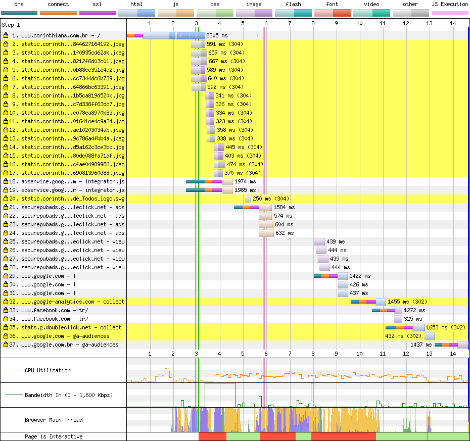

# Corinthians

[Site](https://www.corinthians.com.br/). [WebPageTest](https://www.webpagetest.org/result/190422_TC_37133d6dcc7f049f52b01da90839a845/).

## Primeiro tempo

**Aos 5.4s a tela branca sai de cena** e a renderização começa. Note a diferença entre o frame 10 e o 10.5s. As setas do slider são um sinal claro de que há scripts bloqueando a renderização e colocando aos poucos componentes na tela. Não precisaria de um slider completo nesse momento, já que apenas a primeira partida seria suficiente pro carregamento.

**Como estado pronto para interação vou tomar 15.1s**, ainda que o WebPageTest indique 15.6s, estou considerando o ponto onde a thread principal destrava, além de que o slider já está até trocando de imagem.

Analisar um site com 23.5 MB baixados, sendo 22.1 MB imagens, é como resgatar uma pessoa de um desabamento: você sabe onde a pessoa está, comida e água ajudariam, mas ainda tem 10 tonelados de escombros no caminho. **Qualquer otimização que não seja tirar tudo isso do caminho seria arranhar a superfície.**

Digo isso pois essa quantidade de dados distorce os gráficos. Tudo parece menor do que seria num contexto melhor.

Das primeiras 7 requisições, sem contar a própria página, temos 4 conexões para lugares diferentes, e ao todo são 22 na página. O tempo para conectar-se a estes recursos poderia ser reduzido com `dns-prefetch`, como o Athletico fez.

O CSS, em grande parte, **não é minificado**. Além disso, **duas versões da fonte de ícones** Font Awesome são baixadas, uma do próprio desenvolvedor e outra está dentro de `site.full.css`.

Como mostra o relatório de coverage, a versão baixada de pro.fontawesome tem **apenas 0.7% usados**. Procurei um pouco no arquivo e descobri que são os logos do Spotify, Medium e G+ (pode ter mais algum, mas o arquivo é enorme). Tudo isso pra na linha 11 usar um ícone de busca em SVG (que na minha opinião seria o certo pra todos os ícones).

Muitos scripts estão no fim do `body`, o que atrasa sua descoberta, execução e posteriormente ainda bloqueia a renderização. Isso poderia ser resolvido trazendo-os para o `head` e usando o atributo `defer`. Inclusive, alguns scripts que estão no `head` já fazem uso do `async`, então seria um passo fácil a dar.

A fontes poderiam se aproveitar de um carregamento antecipado também, fazendo o uso do atributo `rel="preload"`.

## Segundo tempo

**Tela branca padrão até 3s** e, apesar de renderizado, a **thread principal fica bloqueada até 10.8s**.

Como não temos cache aqui, o navegador entra em ação e faz este trabalho. Carregar um DOM desse tamanho e re-executar os scripts que já bloquearam a primeira visita são os responsáveis pelo tempo até a interação.

## Custo

São 23.5 MB baixados (22.1 MB de imagens). Num plano de 100 MB a R$ 1,49/dia, acessar este site uma vez por dia custaria R$ 10,50 por mês, ou 7 dias de internet. Sem contar o fato de que você já consumiu 1/4 dos dados do dia inteiro.

## Imagens

 Ninguém deveria passar por isso, mas eu peguei essa foto do Cássio em 4K, com 4096x1280px e 5.95 MB, e comprimi para 76.7 KB em JPEG (99% menor) ou 60.6 KB em WebP. Aliás, **essa imagem pesa mais do que o site inteiro da Chapecoense, do Ceará e do Athletico**, pegando só os que eu analisei até agora.

 Os números a seguir estão corretos: **esse ícone de um jipe tem 5906x5906px** e pesa 253 KB. O ideal seria convertê-lo num SVG de uns 32px, mas eu *apenas reduzi* para 1000px, que em PNG ficou com 20.7 KB (92% menor) ou 21 KB em WebP.

[Veja os resultados](imgs/squoosh).

## Resultado

1. Ceará - 14.9s *
1. Atlético - 15.3s
1. Athletico - 17.4s
1. Chapecoense - 18.4s
1. Corinthians - 25.9s
1. Botafogo - 28s *
1. Bahia - 56.8s
1. Avaí - 61.6s

* Não é responsivo

Com uma imagem que só é menor do que um dos times à frente, o quinto lugar poderia ser melhor com a compressão e lazy load das imagens. Essa deveria ser a prioridade. Indo além, minificação, carregamento apenas do necessário e `defer` ajudariam a reduzir alguns segundos. 

Bom
- HTTPS
- HTTP/2
- gzip

Ruim
- Sem cache
- Minificação parcial
- JS desnecessário
- CSS desnecessário
- Download atrasado de JS
- Download atrasado de fontes
- Fontes de ícones
- Scripts bloqueiam renderização
- Excesso de conexões
- Imagens excessivamente grandes