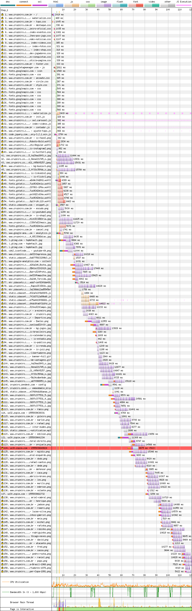
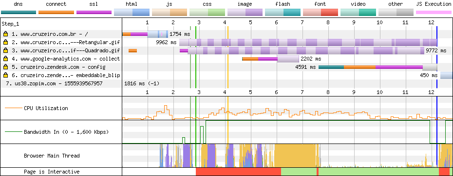

# Cruzeiro

[Site](https://www.cruzeiro.com.br/). [WebPageTest](https://www.webpagetest.org/result/190422_YE_f3b54d67f740e9fdc6bc2848d58b9cd1/).

## Primeiro tempo

**4.2s de tela branca** e após um breve bloqueio da thread, **temos conteúdo aos 7.3s**. Não temos o ícone do menu ainda e a fonte final só entra aos 9.6s, mas **não estou julgando beleza, e sim performance**.

Seguindo essa mesma linha, aproveito para falar sobre as fontes, que são Oswald, Roboto, East Sea Dokdo, Encode Sans Expanded e **respondem por 280 KB**. O download delas está espalhado entras as linhas 37 e 61, e isso poderia ser evitado, corrigindo o carregamento de uma fonte genérica antes da fonte final (FOUT - Flash Of Unstyled Text) usando `preload` (remover algumas fontes ajudaria também).

De volta à ordem cronológica, temos diversos arquivos CSS sendo carregados, **todos sem minificação** e entre eles `materialize.css` e `animate.css`, com **93.6% e 99.8% não utilizados**, respectivamente. Como **o site faz uso do protocolo HTTP/1**, cada recurso gera uma conexão extra. Não bastasse isso, o cabeçalho `keep-alive` presente limita a 5 conexões máximas antes de fechar a conexão. Por esse motivo você vê pelo menos **53 conexões feitas para o próprio domínio do Cruzeiro**.

Mantendo o protocolo HTTP/1, o ideal seria reduzir o número de conexões, consolidando os arquivos CSS (só com o que for usado pela página) em um só.

Por fim, todos os script estão localizados ao final da página e poderiam melhorar os tempo de carregamento se estivessem no `head` usando `defer`.

## Segundo tempo

Ainda que tenhamos uma **tela em branco até 2.8s**, a renderização, que começa logo em seguida, já completa em 5.5s. Apesar disso, a thread principal fica bloqueada por 3 segundos e só libera a **interação a partir de 6.1s**.

Apesar do bom cache, ainda há dois gifs que precisam ser baixados, que juntos somam quase 2 MB! Ainda assim o que bloqueia a renderização e posterior interação são as imagens excessivas e os scripts.

## Custo

São 29.3 MB baixados (28.1 MB de imagens). Num plano de 100 MB a R$ 1,49/dia, acessar este site uma vez por dia custaria R$ 13,09 por mês, ou quase 9 dias de internet. Sem contar o fato de que você já consumiu mais de 1/4 dos dados do dia inteiro.

## Imagens

Uma camisa, apresentada na loja mede **1200x1200px e tem 1.2 MB. Comprimida teria 52.2 KB em JPEG (96% menor), ou 26.5 KB em WebP.**

Um ícone do Instagram com 82x82px e 4.47 KB, **ficaria melhor ainda sendo um SVG e customizado com CSS**, mas ainda assim, comprimido teria 2.67  KB em JPEG (**40% menor**), ou 3.05 KB em WebP.

A compressão, aliada ao lazy load das imagens faria milagres nesse site, no ponto de vista de custo de dados transmitidos.

[Veja os resultados](imgs/squoosh).

## Resultado

1. Cruzeiro - 13.4s
1. Ceará - 14.9s *
1. Atlético - 15.3s
1. Athletico - 17.4s
1. Chapecoense - 18.4s
1. Corinthians - 25.9s
1. Botafogo - 28s *
1. Bahia - 56.8s
1. Avaí - 61.6s

* Não é responsivo

E o Cruzeiro assume duas lideranças: a de site mais rápido até a interação e o de mais pesado. O segredo está nos scripts que não atrasam tanto a renderização, de modo que o site já está utilizável num momento adiantado. Utilizável também não significa que tudo está lá. O tempo poderia ser menor e o resultado em tela também com o `preload` das fontes, `defer` dos scripts e o não carregamento de código que não é usado.

Bom
- HTTPS
- Cache
- gzip

Ruim
- Keep alive
- HTTP/1
- Sem minificação
- JS desnecessário
- CSS desnecessário
- Download atrasado de JS
- Download atrasado de fontes
- Fontes de ícones
- Scripts bloqueiam renderização
- Excesso de conexões
- Muitas imagens