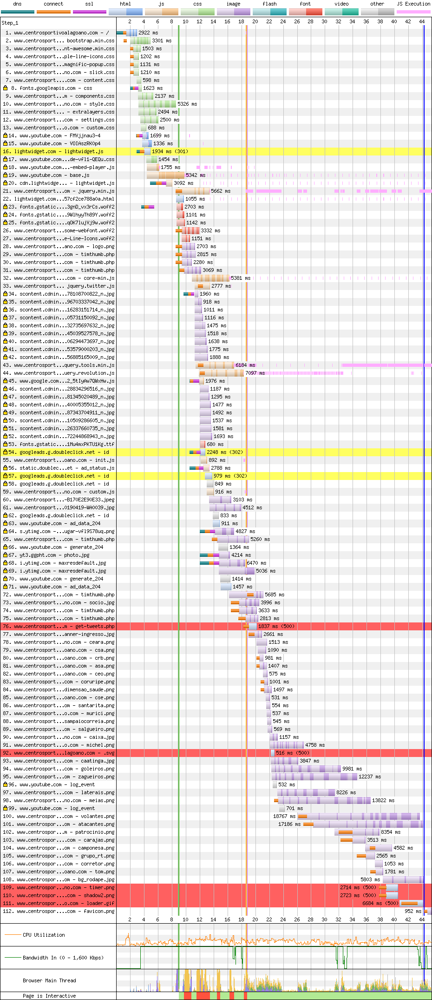
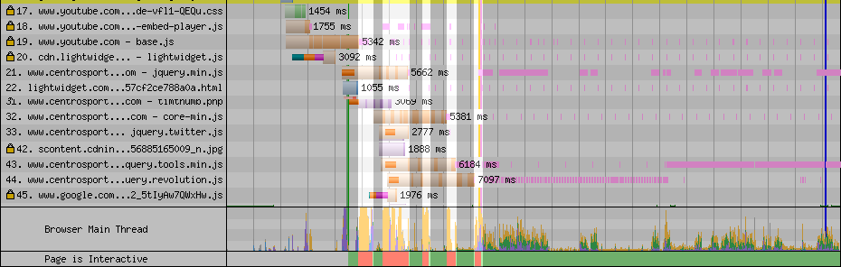
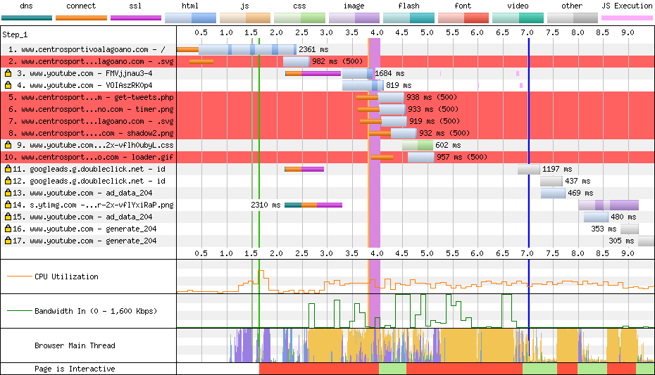

# CSA

[Site](http://www.centrosportivoalagoano.com/). [WebPageTest](https://www.webpagetest.org/result/190422_KR_db00013eb870ccf21cca5bd8c6254612/).

## Primeiro tempo

A única certeza que eu tenho é que teremos **tela em branco, dessa vez por 8.9s**. Apesar disso, a **thread principal fica bloqueada, com pequenos intervalos até 18.8s**. Analisaremos isso logo mais.

A maior parte do CSS e uma parte considerável do JS **não está minificada**, além do **código não usado em geral ser de 79%**.

As fontes são carregadas em um `link` próprio, porém, não se beneficiam do `preload`, o que faz com que sejam carregadas tarde. Além disso, todos os scripts estão no fim do `body`, o que atrasa seu download, execução e consequentemente a renderização do que depende deles. Se você está lendo todos os times, parabéns, você já é um(a) vencedor(a) e sabe o que eu vou dizer aqui: scripts no `head` com `defer` pra destrancar o render (slogan de laxante?).

Com imensa destreza, recortei só a requisição dos scripts do site e aproximei o gráfico no final do relatório que mostra a situação da thread. Veja que todos os bloqueios acontecem ao final ou execução de um script (traçado/linha horizontal rosa).

Tão ruim quanto não ter um cabeçalho `keep alive`, é ter um mal configurado, e aqui nós temos um que **encerra as conexões depois de um timeout de 1 segundo**, o que resulta em 50 conexões, sendo 18 delas para o próprio servidor do CSA. Se colocar 2 zeros aí já resolve o problema. Servidor esse, já que você entrou no assunto, que **utiliza HTTP/1, sem gzip e sem cache.**

Não é por falta de coisa boa pra falar não, mas eu olhei o código escrito nesse site e acho que é o mais bonito até agora, quiçá num possível top 100 que já vi. Bem comentado, **organizado**, usando BEM pro CSS. E digo isso pois **qualquer coisa fica mais fácil de corrigir quando tudo fica tão óbvio com um código limpo**. O que falei acima, com exceção do servidor, liberaria a thread, aceleraria o render e não daria muito trabalho.

## Segundo tempo

Talvez o site visualmente completo com maior antecedência até agora, *MAS*, apesar da **renderização pronta aos 2.1s**, a **thread principal fica bloqueada até os 9.1s**.

Os problemas com script bloqueando a renderização se intensificam em visualizações cacheadas (ainda que aqui o cache vá pra conta do navegador), já que todo conteúdo está pronto, só falta executar.

O que sugeri no primeiro tempo ajudaria aqui também.

## Custo

São 8 MB baixados (5.2 MB de imagens). Num plano de 100 MB a R$ 1,49/dia, acessar este site uma vez por dia custaria R$ 3,57 por mês, ou quase 2 dias e meio de internet.

## Imagens

A imagem dos volantes do time mede 1234x537px e tem 822 KB. **Comprimida teria 571 KB em PNG (30% menor) ou 91.4 KB em WebP.**

Outra imagem sobre associados tem 788x402px, pesando 83.3 KB. **Comprimida teria 79.1 KB em JPEG (5% menor) ou 50.6 KB em WebP**. Pouca diferença? Não se esqueça que eu aumentei ela para 1000px.

[Veja os resultados](imgs/squoosh).

*Compressão e lazy load for the win.*

## Resultado

1. Cruzeiro - 13.4s
1. Ceará - 14.9s *
1. Atlético - 15.3s
1. Athletico - 17.4s
1. Chapecoense - 18.4s
1. Corinthians - 25.9s
1. CSA - 27.9s
1. Botafogo - 28s *
1. Bahia - 56.8s
1. Avaí - 61.6s

* Não é responsivo

Nem tudo está perdido. Algumas coisas bem simples trariam resultados consideráveis e imediatos: scripts com `defer`, `preload` de fontes, e uma conexão com o servidor que não se feche a cada 1 segundo, poderia reduzir o tempo do CSA em pelo menos 12s.

Bom
- Código limpo ¯\_(ツ)_/¯

Ruim
- Sem cache
- Sem gzip
- HTTP
- Sem keep alive
- HTTP/1
- Sem minificação
- JS desnecessário
- CSS desnecessário
- Download atrasado de JS
- Download atrasado de fontes
- Fontes de ícones
- Scripts bloqueiam renderização
- Excesso de conexões