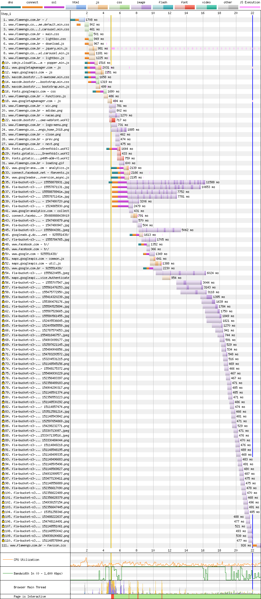
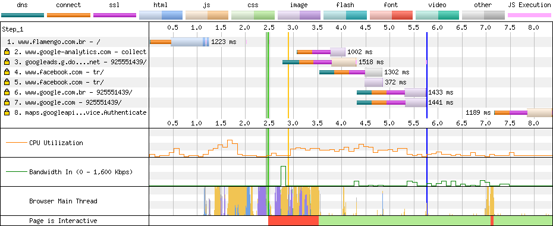

# Flamengo

[Site](http://www.flamengo.com.br/). [WebPageTest](https://www.webpagetest.org/result/190422_QQ_fbf21a0a0329b4ed785ff56490349049/).

## Primeiro tempo

**Sem conteúdo na tela até 4.8s**, quando começa a renderizar com alguns gargalos dos scripts, **ficando interativa a partir de 7.9s**, quando carrega o cabeçalho.

A maioria dos arquivos CSS e JS **não estão minificados** e no total, **72% do código não é usado na renderização**. Do pouco de JS que é usado, atrapalha a renderização. A maioria dos scripts, com exceção de um, está localizada no `head` mas não se beneficia do uso do `defer` para atrasar a execução e evitar o bloqueio da renderização e da thread. Ainda assim, são só 38 KB de CSS e 121 KB de fontes.

O PROERD precisa incluir fontes de ícones nas aulas. **98.8% da fonte não é usada**, o que poderia ser substuído por alguns ícones em SVG.

Ainda no assunto das fontes, `preload` em cada `link` agilizaria o carregamento delas (linha 28)

## Segundo tempo

**Tela branca até 2.4s**, e 1s depois, **aos 3.5s, página interativa** (após 1 segundo de thread bloqueada).

Graças ao navegador, todos os recursos estão cacheados. O bloqueio da thread é um pouco mais pesado aqui pois tudo acontece em menos tempo, mas poderia ser corrigido com o que eu falei acima.

## Custo

São 2.5 MB baixados (2 MB de imagens). Num plano de 100 MB a R$ 1,49/dia, acessar este site uma vez por dia custaria R$ 1,12 por mês, menos de 1 dia de internet.

## Imagens

Aqui eu fico feliz e puto. O Flamengo tem imagens para mobile! Mas elas são carregadas de qualquer forma no desktop e vice versa. Isso porque quem decide se elas estão **VISÍVEIS** é o CSS. Com Bootstrap, uma classe esconde as imagens pequenas acima de determinado breakpoint e mostra abaixo dele, mas isso não interfere no fato de que elas são baixadas da mesma forma. Aliás, isso é pior que se fosse carregada só a imagem grande!

O mais inacreditável é que já tá sendo usado `picture`, seria só colocar as duas imagens ali dentro e criar as regras.

Em sinal de protesto, vou comprimir duas imagens iguais, uma pro desktop e a outra pro mobile, **sem redimensionar**.

Um dos banners mede 2560x480px e 382 KB, e **passaria para 162 KB em JPEG (58% menor) ou 137 KB em WebP**.

O mesmo banner na versão mobile mede 767x480px e tem 141 KB. **Comprimido teria 58.1 KB em JPEG (59% menor) ou 45.5 KB em WebP**

[Veja os resultados](imgs/squoosh).

## Resultado

1. Flamengo - 11.5s
1. Cruzeiro - 13.4s
1. Ceará - 14.9s *
1. Atlético - 15.3s
1. Athletico - 17.4s
1. Chapecoense - 18.4s
1. Corinthians - 25.9s
1. CSA - 27.9s
1. Botafogo - 28s *
1. Bahia - 56.8s
1. Avaí - 61.6s

* Não é responsivo

Assim como o Cruzeiro, o Flamengo assume duas lideranças ao mesmo tempo: site mais leve e mais rápido. Pra ser ter uma ideia, ele **pesa mais de 2x menos que uma imagem do site do Corinthians**. Esse tempo poderia melhorar com `defer` nos scripts e `dns-prefetch` nos recursos que dependem de CDN. Se minificar o código, melhorar o `keep alive` (de 5 pra 10 de timeout) e em últimos casos mudar o servidor para HTTP/2, **consegue baixar pelo menos 2s desse tempo**.

Bom
- gzip

Ruim
- Sem cache
- HTTP
- Compressão de imagens
- Keep alive poderia ser maior
- HTTP/1
- Sem minificação
- JS desnecessário
- CSS desnecessário
- Download atrasado de JS
- Download atrasado de fontes
- Fontes de ícones
- Scripts bloqueiam renderização