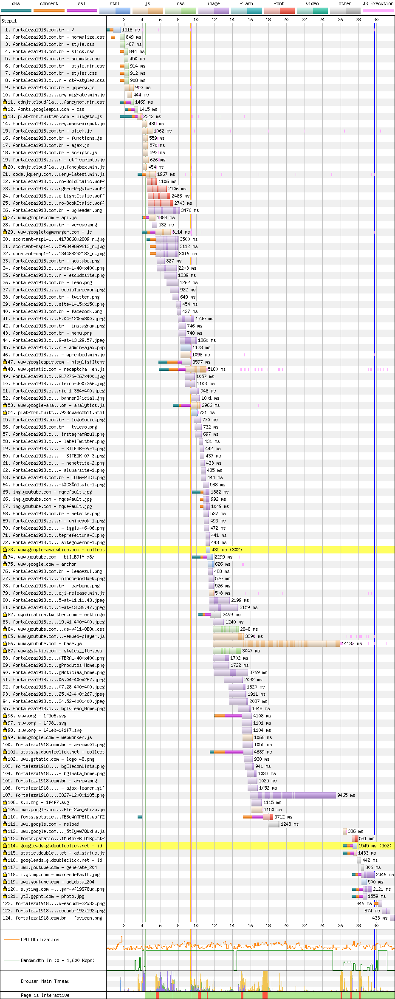
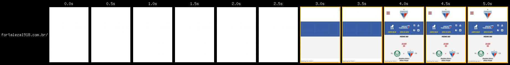
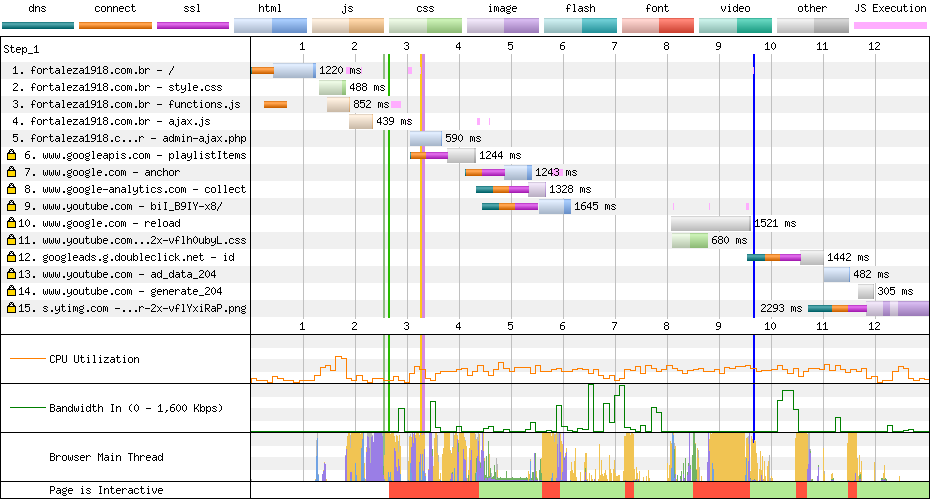

# Fortaleza

[Site](http://www.fortaleza1918.com.br/). [WebPageTest](https://www.webpagetest.org/result/190422_GY_8c27b162b9169be2ec43f6bc1b5ab946/).

## Primeiro tempo


São **4.2s de tela em branco**, até que aos 8.8s o JavaScript adiciona o botão do menu e temos a página interativa.



O primeiro problema é algo que já vimos algumas vezes: diversas conexões para servidores diferentes (as linhas verde-laranja-rosa). Além disso, você percebe antes dos arquivos CSS uma linha laranja, que aponta que a conexão está sendo refeita com o servidor. Isso poderia ser resolvido com `dns-prefetch`, que já é usado na página para outros domínios:

```html
<link rel='dns-prefetch' href='//platform.twitter.com' />
<link rel='dns-prefetch' href='//www.google.com' />
<link rel='dns-prefetch' href='//s.w.org' />
```

A maior parte dos arquivos CSS **não está minificada**, porém o gzip está presente para diminuir o sofrimento. O mesmo ocorre com os scrits.

A maior parte dos scripts é carregada no fim do `body` e poderia ajudar a melhorar a performance se estivesse no `head` com `defer`. Além disso, algumas fontes carregadas localmente usam o formato `woff`, que não é o mais recente e mais comprimido. Não fosse o bastante, elas são importadas dentro do CSS e precisam esperar pela execução dele para começar a baixar. Isso poderia ser resolvido com `preload`.

## Segundo tempo



A renderização começa aos 2.6s, mas **a thread principal não é liberada até os 4.4s**.



Apesar de não termos cache no site e de o navegador tentar o possível, ainda assim temos o download de alguns scripts e CSS novamente.

A thread principal ainda fica bloqueada novamente por algumas vezes devido a execução de scripts, o que seria resolvido com as ações que citei acima.

## Custo

São 4.3 MB baixados (2.7 MB de imagens). Num plano de 100 MB a R$ 1,49/dia, acessar este site uma vez por dia custaria R$ 1,92 por mês, pouco mais de 1 dia de internet.

## Imagens

O site mostra a imagem de todos os jogadores, mas elas **são baixadas de acordo com o carregamento** num carousel. A primeira é do goleiro e tem 1200x1185px, pesa 1.32 MB e **teria 850 KB em PNG (36% menor) ou 163 KB em WebP**.

A imagem do título mede 1200x800px, tem 131 KB, e comprimida teria 103 KB em JPEG (21% menor) ou 63 KB em WebP. A redução em JPEG parece pequena se comparada às demais compressões, isso porque, se você reparar no nome da imagem, **ela veio do Whatsapp**, que já maltrata as imagens.

Lazy load e compressão reduziriam o tamanho geral da página.

[Veja os resultados](imgs/squoosh).

## Resultado

1. Flamengo - 11.5s
1. Fortaleza - 13.2s
1. Cruzeiro - 13.4s
1. Ceará - 14.9s *
1. Atlético - 15.3s
1. Fluminense - 15.3s
1. Athletico - 17.4s
1. Chapecoense - 18.4s
1. Corinthians - 25.9s
1. CSA - 27.9s
1. Botafogo - 28s *
1. Bahia - 56.8s
1. Avaí - 61.6s

Não é responsivo *

Se for pra ter pelo menos uma coisa certa, que seja gzip. É a conclusão que eu chego, já que os scripts vão ser carregados de forma que bloquearão a renderização, pelo menos que baixem rápido.

Bom
- gzip

Ruim
- Sem minificação
- Sem cache
- HTTP
- HTTP/1
- Compressão de imagens
- JS desnecessário
- CSS desnecessário
- Download atrasado de JS
- Download atrasado de fontes
- Fontes com baixa compressão
- Scripts bloqueiam renderização