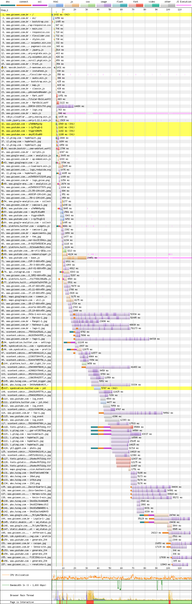
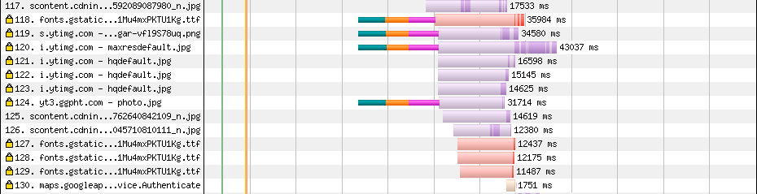
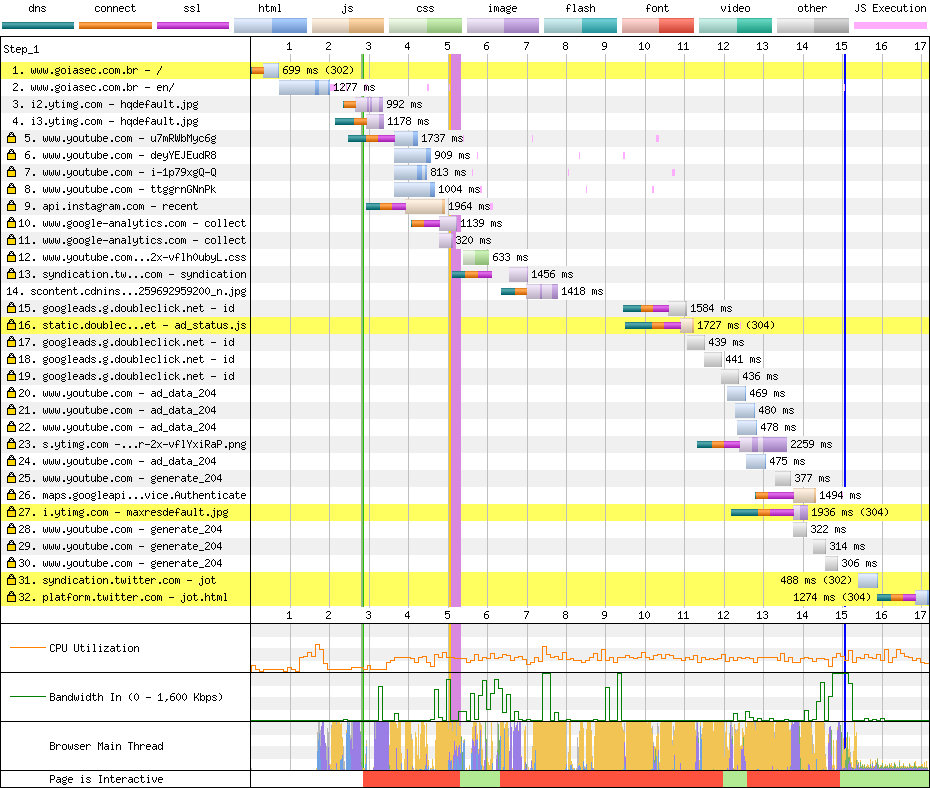

# Goiás

[Site](http://www.goiasec.com.br/). [WebPageTest](https://www.webpagetest.org/result/190422_ZH_5d89905c0e7d80980948fe63164b5785/).

## Primeiro tempo


A primeira experiência do usuário aqui são **3.8s de tela vazia**. Pelo fato do texto do cabeçalho ser branco, considero a **página pronta para interação** a partir do momento em que ele se torna legível, ou seja, quando a imagem de fundo carrega o suficiente para o texto estar visível, o que acontece em 15.4s.



As primeiras linhas dão a prévia do que virá pela frente: na linha 3 a versão 3.1.1 do Bootstrap é baixada (**97.6% não é usado**) e na linha 4 a versão 2.3.2 (**89.8% não é usado**). **Sem minificação e sem cache, porém gzipados**. Nas linhas 11 e 31 também temos **duas versões diferentes do jQuery**, uma baixada do `head` e outra do fim do `body`.

Os scripts localizados no fim do documento poderiam se beneficiar de um carregamento mais rápido, além de não bloquear a renderização se fizessem uso do `defer` e estivesse no `head`.

As fontes usadas diretamente no site são requisitadas de dentro do CSS e dependem da análise completa do arquivo para começarem a ser requisitados para o servidor:

```css
@font-face {
    font-family: 'MarkBold';
    src: url('../fonts/MarkBold.eot');
    src: local('☺'), 
    url('../fonts/MarkBold.woff') format('woff'), 
    url('../fonts/MarkBold.ttf') format('truetype'), 
    url('../fonts/MarkBold.svg') format('svg');
    font-weight: normal;
    font-style: normal;
}
```

Este processo poderia ser agilizado usando `link`s com `preload`.



Mais pra baixo um script ainda solicita fontes no formato `ttf`, que tem uma das piores compressões possíveis.

O fato do servidor servir o conteúdo em HTTP/1 também acaba comprometendo a performance geral, já que muitos arquivos grandes ocupam as poucas conexões disponíveis.

## Segundo tempo


A renderização começa aos 2.8s e parece completa aos 4.4s, porém, a **thread principal está bloqueada até 14.9s**.



O navegador faz o que pode. Ainda que não haja cache por parte da página, o browser serve o conteúdo da última visita, porém, como **várias requisições são externas**, são 14 conexões que precisam ser feitas, além de que os **scripts bloqueiam a interação por 12s**.

A eliminação de scripts desnecessário e o atraso em suas execuções, propostas que citei acima, ajudariam aqui.

## Custo

São 36.1 MB baixados (33 MB de imagens). Num plano de 100 MB a R$ 1,49/dia, acessar este site uma vez por dia custaria R$ 16,14 por mês, praticamente 11 dias de internet.

## Imagens

Todos os jogadores do time têm sua foto carregada desde o início. A que eu peguei mede **3456x5186px e pesa 1.23 MB**. Comprimida teria 95.9 KB em JPEG (92% menor) ou **46.2 KB em WebP**.

O site usa uma fonte de ícones mas também vários ícones no formato SVG, o problema é o tamanho desses ícones. Um deles pesa 4 KB e teria 739 bytes (82% menor) comprimido, ainda em SVG. Para essa compressão usei a ferramenta [SVGOMG](https://jakearchibald.github.io/svgomg/).

[Veja os resultados](imgs/squoosh).

23 imagens tem pelo menos 1 MB, de um total de 156 imagens e 33 MB. Só com compressão daria para trazer esse número para uns 5 MB.

## Resultado

1. Flamengo - 11.5s
1. Fortaleza - 13.2s
1. Cruzeiro - 13.4s
1. Ceará - 14.9s *
1. Atlético - 15.3s
1. Fluminense - 15.3s
1. Athletico - 17.4s
1. Chapecoense - 18.4s
1. Corinthians - 25.9s
1. CSA - 27.9s
1. Botafogo - 28s *
1. Goiás - 30.3s
1. Bahia - 56.8s
1. Avaí - 61.6s

* Não é responsivo

Lembra do meu conselho de antes pra se for ter uma coisa, que seja gzip? É o que tem aqui, mas há milagre que ele faça com o site *mais pesado* até agora.

Bom
- gzip

Ruim
- Sem minificação
- Sem cache
- HTTP
- HTTP/1
- Compressão de imagens
- JS desnecessário
- Scripts duplicados
- CSS duplicado
- CSS desnecessário
- Download atrasado de JS
- Download atrasado de fontes
- Fontes de ícones
- Fontes com baixa compressão
- Scripts bloqueiam renderização
- Excesso de requisições
- Muitas imagens