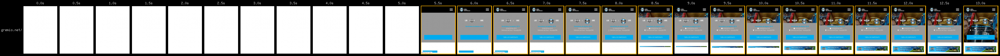
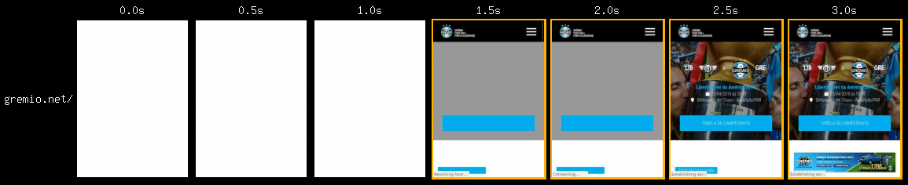
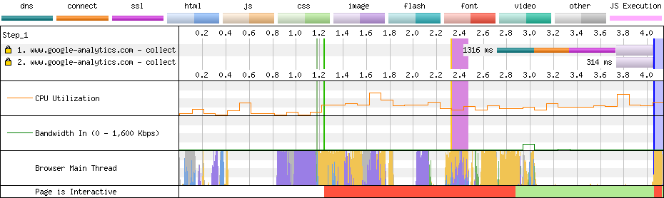

# Grêmio

[Site](https://gremio.net/). [WebPageTest](https://www.webpagetest.org/result/190422_QE_cf47f142f8a4784b2e7cc4b8d4a50a18/).

## Primeiro tempo



Após **5s de nada** a renderização começa. O site já está usável em 7s, após **1s de thread principal bloqueada**.

Se você está acompanhando em ordem, percebeu a estratégia que **rendeu ao Grêmio alguns segundos enquanto que o Goiás perdeu tempo aqui**: fundo escuro onde virá a imagem para que o texto esteja legível o mais breve possível e não dependa do carregamento infinito da imagem ali atrás.


Uma desatenção aqui me deu um ótimo exemplo. Na linha 4 o arquivo `style.css` importa fontes e outros arquivos CSS.

```css
@import url("https://maxcdn.bootstrapcdn.com/bootstrap/3.3.7/css/bootstrap.min.css");
@import url("https://use.fontawesome.com/releases/v5.6.3/css/all.css");
@import url("https://fonts.googleapis.com/css?family=Roboto+Condensed:300,400,500,700,900&subset=latin,latin-ext");
@import url("owl.carousel.css");
@import url("sub-escola.css");
```

Dessa forma, estes arquivos só começarão a ser baixados depois da análise completa do arquivo atual, o que pode ser comprovado pelas linhas 5, 7, 8, 9 e 10. Acontece que o arquivo `owl.carousel.css` é o primeiro a ser baixado, já na linha. Você consegue imaginar o porquê?

Isso se deve pelo fato do mesmo arquivo já ter sido requisitado por um `link` no HTML, que é o que **deveria estar sendo feito com todos estes recursos**. Isso reduziria em pelo menos 2s o tempo de início do download do `bootstrap.min.css`, na linha 8.

Além disso, são carregados 212 KB de fontes, sendo que **166.6 KB são de fontes de ícones**. A título de comparação, a soma de todo JS da página pesa 179 KB e todo CSS 49.8 KB. Destes, 64% não é usado.


Aproximei estas requisições do gráfico que mostra a thread principal para você ver o culpado pelo 1s de thread bloqueada: o script `main.js`.

Isso poderia ser otimizado trazendo os scripts que estão no fim do `body` para o `head` com o atributo `defer`.

## Segundo tempo



**Mais uma vez a renderização é bloqueada por um script**, depois de **1.3s de tela em branco**, o site estaria no mesmo estado de interatividade do primeiro tempo aos 2.3s, mas a thread bloqueada segura isso até os 2.9s.



Apesar de o site não ter cache, o navegador dá uma mãozinha e apenas duas requisições são feitas. A thread principal fica bloqueada mais uma vez, provavelmente pelo mesmo script. A correção dele refletiria no resultado daqui.

## Custo

São 4.5 MB baixados (4 MB de imagens). Num plano de 100 MB a R$ 1,49/dia, acessar este site uma vez por dia custaria R$ 2,01 por mês, pouco mais de 1 dia de internet.

## Imagens

O Grêmio comprime as imagens no servidor e as serve ao navegador prontas.

Essa imagem com 1371x600px e 111 KB, chegaria a 104 KB em JPEG se eu apenas comprimisse (**7% de ganho**). Mas como estamos falando de mobile, vou redimensionar e comprimir. **Em JPEG ela teria 61.7 KB (45% menor) ou 38.6 KB.**

Aplicando o mesmo processo a uma imagem com 1920x540px e 268 KB, chegaríamos a **40.3 KB em JPEG (85% menor) ou 30.5 KB em WebP.**

[Veja os resultados](imgs/squoosh).

A compressão já está sendo feita. Um passo além seria o carregamento atrasado das imagens (lazy load) e o uso de imagens específicas para mobile com `srcset` ou `picture`.

## Resultado

1. Grêmio - 9.9s
1. Flamengo - 11.5s
1. Fortaleza - 13.2s
1. Cruzeiro - 13.4s
1. Ceará - 14.9s *
1. Atlético - 15.3s
1. Fluminense - 15.3s
1. Athletico - 17.4s
1. Chapecoense - 18.4s
1. Corinthians - 25.9s
1. CSA - 27.9s
1. Botafogo - 28s *
1. Goiás - 30.3s
1. Bahia - 56.8s
1. Avaí - 61.6s

Não é responsivo *

O Grêmio assume a liderança com 1.6s de folga para o Flamengo, com uma margem mínima para melhorar de 1.5s, graças àquele script bloqueando o render. Além disso, é o único que baixa da casa dos 2 dígitos.

Bom
- gzip
- HTTPS
- Compressão de imagens
- HTML minificado

Ruim
- Minificação parcial
- Sem cache
- HTTP/1
- JS desnecessário
- CSS desnecessário
- Download atrasado de JS
- Download atrasado de fontes
- Fontes de ícones
- Scripts bloqueiam renderização