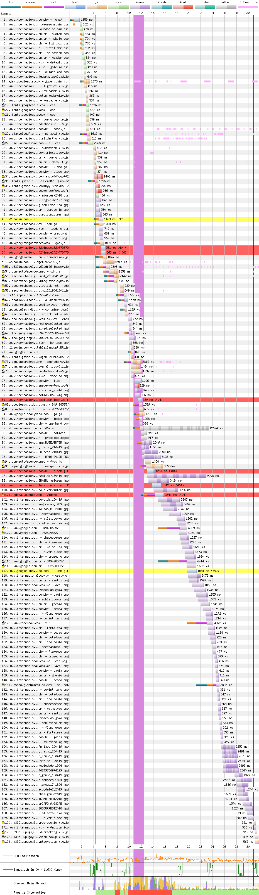
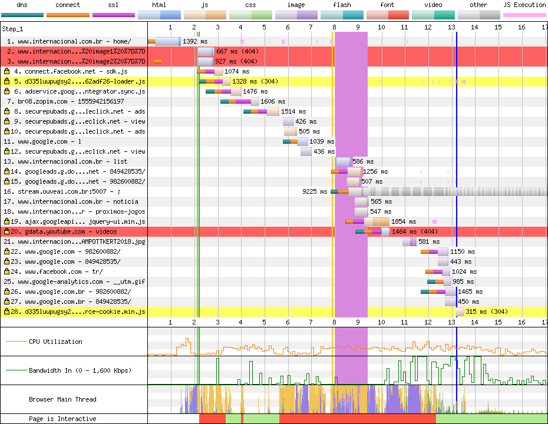

# Internacional

[Site](http://www.internacional.com.br/home/). [WebPageTest](https://www.webpagetest.org/result/190422_M5_c92e0ae45d1201194bdfdd4da0a223c9/).

## Primeiro tempo

Após 4.2s de tela em branco, a renderização começa mas não avança praticamente nada até os 13s. Não bastasse isso, a **thread principal está bloqueada até 17.2s**.

Aqui as fontes são a primeira coisa escrita no HTML, mas só são baixadas na linha 19, devido ao tempo de conexão. Melhor que isso, só se tivesse `preload` junto, o que adiantaria o download delas que só ocorre na requisição 34.

Praticamente todos scripts e CSS estão minificados, **com exceção de um arquivo de estilo com 6700 linhas**. No geral, **64% do código não é usado, ou 1.9 MB**.

Todo esse código não usado (1.3 MB só de JS) segura uma otimização: todos os scripts estão no `head` e alguns usam `defer`. Suponho que os 5 scripts usando `defer` tenham sido analisados e os demais não o usam devido a alguma interação que deve ser executada de forma síncrona. 

Mas como eu sou curioso, resolvi executar o JavaScript Profiler no CDT e descobri que o responsável pelo bloqueio da thread é o script `widget_v2.293.js`, que **pesa 246 KB gzipado mas descomprimido vai a 1 MB**! Você pode vê-lo sendo baixado na linha 52 (final 290.js). Este script é responsável por colocar uma janela de chat ao vivo no rodapé.

## Segundo tempo

A partir de 2.1s a tela branca dá lugar à lenta e vagarosa renderização. A interação acontece aos **12.3s, quando a thread é desbloqueada**.

Como são muitas requisições externas, o navegador ainda tem muito contato a fazer na segunda visita, o que é amenizado pelo cache do site, que apesar de curto (4 horas), existe. O mesmo problema de bloqueio do render acontece aqui, provavelmente pelo mesmo script.

## Custo

São 6 MB baixados (4.3 MB de imagens). Num plano de 100 MB a R$ 1,49/dia, acessar este site uma vez por dia custaria R$ 2,68 por mês, quase 2 dias de internet.

## Imagens

O Internacional faz uso do carregamento atrasado de imagens (lazy loading), o que reduz o tamanho da página e a quantidade de dados além da compressão de algumas imagens.

Uma imagem sem compressão, de 856x420px pesando 519 KB em PNG, teria, comprimida, 66.7 KB em JPEG (87% menor) ou 41.6 KB em WebP.

Outra foto, agora com 710x420px e 68.7 KB, aparentemente já comprimida, chegaria a 59.6 KB em JPEG (13% menor) ou 38.9 KB em WebP.

[Veja os resultados](imgs/squoosh).

Para o tratamento de imagens ficar completo, só falta o uso de imagens específicas para mobile com `srcset` ou `picture`.

## Resultado

1. Grêmio - 9.9s
1. Flamengo - 11.5s
1. Fortaleza - 13.2s
1. Cruzeiro - 13.4s
1. Ceará - 14.9s *
1. Atlético - 15.3s
1. Fluminense - 15.3s
1. Athletico - 17.4s
1. Chapecoense - 18.4s
1. Corinthians - 25.9s
1. CSA - 27.9s
1. Botafogo - 28s *
1. Internacional - 29.5s
1. Goiás - 30.3s
1. Bahia - 56.8s
1. Avaí - 61.6s

Não é responsivo *

Uma coisa precisa ser discutida: a possibilidade de uma interação por chat, **vale mais do que a interação com página em si**? Afinal, se a pessoa não esperar 15s até a página destravar, ela não vai usar o chat. Corrigindo só este script, o Internacional **pode melhorar em pelo menos 13s**.

Bom
- gzip
- defer
- Lazy loading
- Compressão parcial de imagens

Ruim
- Cache muito curto
- HTTP
- Compressão de imagens
- Minificação parcial
- HTTP/1
- JS desnecessário
- CSS desnecessário
- Download atrasado de fontes
- Fontes de ícones
- Scripts bloqueiam renderização