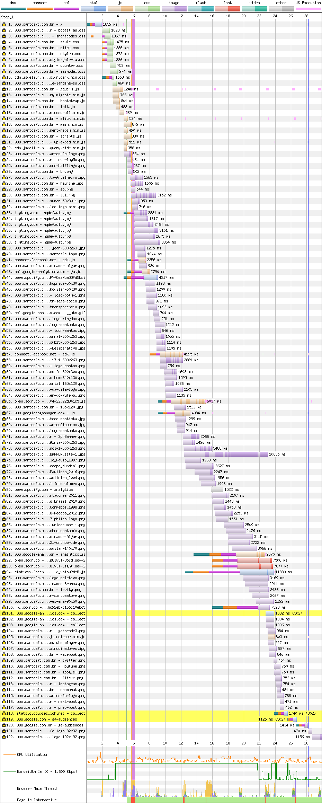
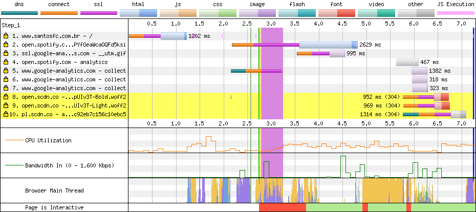

# Santos

[Site](https://www.santosfc.com.br/). [WebPageTest](https://www.webpagetest.org/result/190422_7C_5c3c4af266a88a08604240edcb71bb01/).

## Primeiro tempo

Após **5s de nada na tela**, a renderização começa. Os elementos vão sendo jogados de um lado para o outro, conforme os scripts vão sendo executados, até que aos 9.2s o slider do cabeçalho carrega.

O CSS carregado logo no começo está **parcialmente minificado** e junto com os scripts totalizam **76% de código não utilizado**. Além disso, duas versões do Bootstrap são carregadas.

É possível ver o degrau entre os scripts carregados no `head` e os ao final do `body`, na linha 16. Seria possível ganhar quase 1 segundo no último download se todos estivessem no `head` com `defer`.

O site não usa nenhuma fonte externa... para si próprio, pois **o widget do Spotify baixa 165 KB em duas versões da fonte Circular**.

## Segundo tempo

Passados 2.7s de tela em branco, parece que o site está pronto, porém, **a thread principal fica bloqueada até 3.8s**

Ainda que o site não defina o cache, o navegador entra em ação e salva o dia, restando apenas algumas conexões, entre elas com o Spotify, **mais uma vez baixando suas fontes**.

A execução simultânea de diversos scripts (plugins do jQuery) travam a thread e bloqueiam a interação.

## Custo

São 3.5 MB baixados (2.8 MB de imagens). Num plano de 100 MB a R$ 1,49/dia, acessar este site uma vez por dia custaria R$ 1,56 por mês, praticamente 1 dia de internet.

## Imagens

A imagem de uma jogadora mede 700x700px pesando 75.3 KB em PNG. **Comprimida teria 58.4 KB em JPEG (22% menor) ou 33.8 KB em WebP.**

Um banner que mede 951x130px e pesa 1.09 MB. Após a compressão fica com 24.4 KB em JPEG (98% menor) ou 17.4 KB em WebP.

[Veja os resultados](imgs/squoosh).

Poderia aproveitar a compressão e carregamento atrasado das imagens para reduzir a carga de dados transferidos.

## Resultado

1. Grêmio - 9.9s
1. Flamengo - 11.5s
1. Santos - 13s
1. Fortaleza - 13.2s
1. Cruzeiro - 13.4s
1. Ceará - 14.9s *
1. Atlético - 15.3s
1. Fluminense - 15.3s
1. Athletico - 17.4s
1. Chapecoense - 18.4s
1. Corinthians - 25.9s
1. CSA - 27.9s
1. Botafogo - 28s *
1. Internacional - 29.5s
1. Goiás - 30.3s
1. Palmeiras - 33.5s *
1. Bahia - 56.8s
1. Avaí - 61.6s

Não é responsivo *

Atrasar a execução de scripts que não interferem no visual e interatividade da página poderia ajudar com a experiência do usuário aqui, alguns exemplos são scripts que mudam a dinâmica do scroll e o próprio Spotify. Quero conhecer o santista que chega no site do Santos só pra ouvir música.

Bom
- gzip
- HTTPS

Ruim
- Sem cache
- Compressão de imagens
- Minificação parcial
- HTTP/1
- JS desnecessário
- CSS desnecessário
- CSS duplicado
- Download atrasado de JS
- Download atrasado de fontes
- Scripts bloqueiam renderização