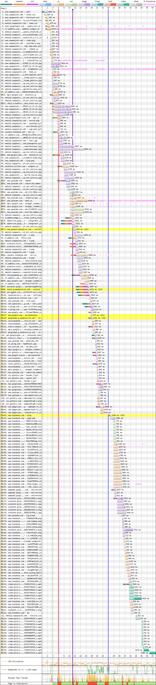
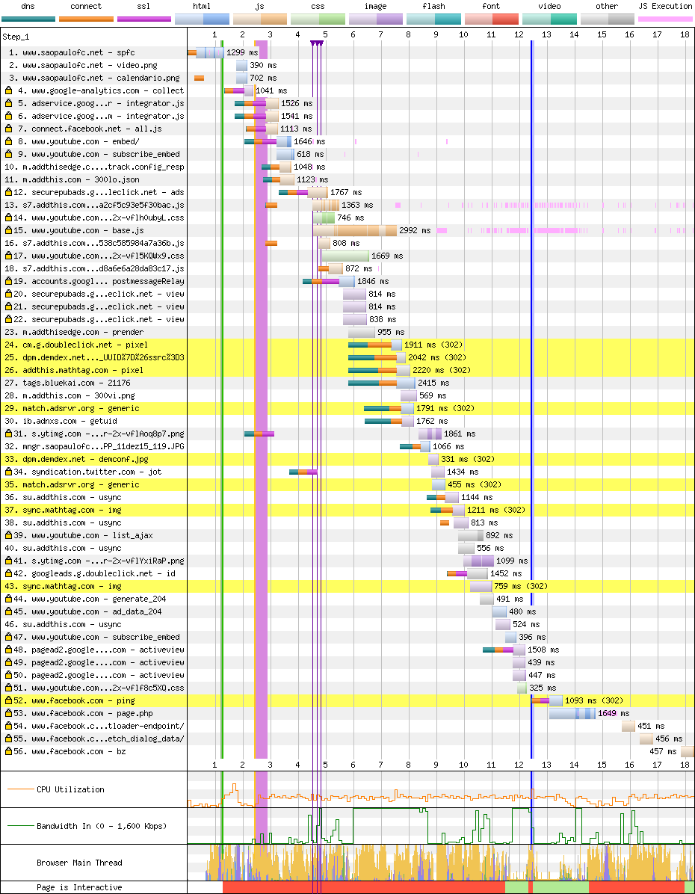

# São Paulo

[Site](http://www.saopaulofc.net/spfc). [WebPageTest](https://www.webpagetest.org/result/190422_MZ_aa46261095fcc9e57f215f6c9fa729a3/).

## Primeiro tempo

Após **3.3s de tela em branco**, a página, que **não é responsiva**, começa a renderizar. Em 10.8s temos o texto do primeiro item do slider, o que seria a primeira possibilidade de interação.

Seria. Mas os diversos scripts executando (traços/linhas horizontais rosa) **atrasam a renderização e bloqueiam a thread principal diversas vezes**, sendo o período mais longo entre 15 e 23s. Aos **22.6s termina o bloqueio**.

A maior parte do CSS e JS carregados **não está minificada**, porém o **gzip** ajuda na compressão, que poderia ser melhor. Destes, **56% não é utilizado (1.3MB)**.

Uma conclusão que cheguei, tendo analisado 19 site até agora é que **scripts externos não estão preocupados com a perfomance do SEU site**. Por *script externo* me refiro principalmente a widgets, como as linhas 5, 65 e da 152 em diante (o Facebook carrega 15 scripts ali). Veja que eles estão constantemente em execução, **procupados com que eles próprios sejam performáticos**, não necessariamente o ambiente ao redor.

No desktop, aliás, de 322 requisições, 78 são do Facebook, sendo 48 scripts, pesando 1.8 MB e totalizando 10.5 MB após a descompressão. Com **15.1 MB de scripts** descomprimidos no total, o resultado não poderia ser diferente.

Trazer estes scripts para o `head` e usar o máximo possível de `defer` poderia ajudar no desbloqueio da renderização, mas de qualquer forma, no momento que eles entrassem em execução, **o bloqueio aconteceria da mesma forma**.

Apenas uma fonte é carregada pelo site (outra é solicitado pelo YouTube), e demora para começar a carregar pelo fato de sua requisição estar **dentro de um CSS** e depender de sua análise. Um `link` externo já resolveria.

## Segundo tempo

Após **1.2s de tela em branco**, a renderização está praticamente pronta aos 9.1s.

Porém, a thread está bloqueada desde o começo, e **só é liberada aos 15.5s**. Além disso, apesar do cache do site fazer seu trabalho, a imensidão de conteúdo externo precisa ser recarregada.

Os mesmos scripts que bloqueavam a thread na primeira visita bloqueiam aqui. Uma solução possível para manter os widgets de redes sociais e não ter tanto impacto na performance, seria **atrasar o carregamento deles para quando entrassem na tela** (como o que eu faço aqui no blog com a seção de comentários no rodapé). Só que no mobile não faria diferença pois, *wait for it*, o site inteiro já está carregado na tela.

## Custo

São 7 MB baixados (1.7 MB de imagens e 3.3 MB de scripts). Num plano de 100 MB a R$ 1,49/dia, acessar este site uma vez por dia custaria R$ 3,13 por mês, ou 2 dias de internet.

## Imagens

Um dos principais banners mede 680x350px pesando 128 KB. **Comprimida teria 69.6 KB em JPEG (45% menor) ou 46.3 KB em WebP.**

A foto dos jogadores mede 1000x420px e pesa 50.8 KB. Após a compressão fica com 32.5 KB em JPEG (36% menor) ou 20.5 KB em WebP.

[Veja os resultados](imgs/squoosh).

Aparentemente existe uma compressão, que deve ser **por parte do trabalho de exportação das imagens**, visto que outros clubes que usam compressão, como Grêmio e Internacional, conseguimos reduções pequenas, geralmente abaixo dos 10%, enquanto que aqui, ainda que bem abaixo dos 80-90% que encontramos na maioria dos clubes, ainda fica acima do que seria uma compressão gerada por um algorítmo ótimo.

## Resultado

1. Grêmio - 9.9s
1. Flamengo - 11.5s
1. Santos - 13s
1. Fortaleza - 13.2s
1. Cruzeiro - 13.4s
1. Ceará - 14.9s *
1. Atlético - 15.3s
1. Fluminense - 15.3s
1. Athletico - 17.4s
1. Chapecoense - 18.4s
1. Corinthians - 25.9s
1. CSA - 27.9s
1. Botafogo - 28s *
1. Internacional - 29.5s
1. Goiás - 30.3s
1. Palmeiras - 33.5s *
1. São Paulo - 38.1s *
1. Bahia - 56.8s
1. Avaí - 61.6s

* Não é responsivo

As soluções que apontei acima, como o atraso do carregamento dos widgets sociais só teria efeito se estes elementos estivessem fora da tela, num site responsivo.

Bom
- gzip
- Cache

Ruim
- Compressão de imagens parcial
- HTTP
- Sem minificação
- HTTP/1
- JS desnecessário
- CSS desnecessário
- Download atrasado de JS
- Download atrasado de fontes
- Scripts bloqueiam renderização
- Excesso de requisições