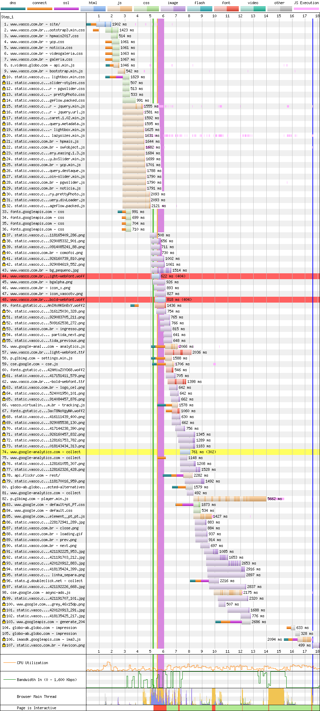
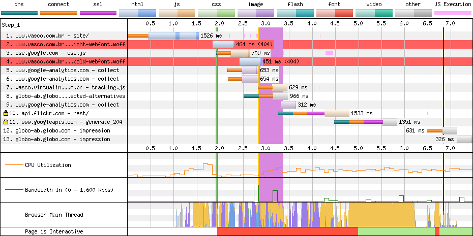

# Vasco

[Site](http://www.vasco.com.br/site/). [WebPageTest](https://www.webpagetest.org/result/190422_KP_2ee025c613c3832900fab106799f6052/).

## Primeiro tempo

São **5.2s de tela em branco**, enquanto que só aos **8.3s as fontes carregam**.

Enquanto que o Cruzeiro sofria com o FOUT (Flash of Unstyled Text), o Vasco sofre com o **FOIT (Flash of Invisible Text)**. Este último acontece nesse caso pois a requisição da fonte principal acaba em 404 (linhas vermelhas), o que obriga o navegador a baixar a próxima fonte, que tem uma **péssima compressão** (`ttf`) e consequentemente leva mais tempo para baixar.

A solução poderia ser simplesmente carregar a fonte mais rápido (evitar o 404 já resolveria) ou usar a [FontFace API](https://developer.mozilla.org/en-US/docs/Web/API/FontFace/load) e o evento de `load` para carregar um fonte qualquer antes da definitiva. Além disso, são **5 fontes baixadas no total**, pesando 132 KB.

A maioria dos arquivos CSS e JS além de **subutilizados** (68% é inútil) **não estão minificados**.

É possível perceber ainda o bloqueio que os scripts causam no download de outros arquivos (além do bloqueio do render, claro) pelos degraus no relatório. Ainda que todos estejam no `head`, muitos poderiam beneficiar a renderização se não fossem carregados imediatamente (usar `defer`).

Uma solução inteligente usada aqui, foi servir o **conteúdo estático a partir de um servidor com HTTP/2 e SSL**. Isso fica bem claro pelas conexões com o cadeado na frente, que vêm desse servidor e adianta bastante o trabalho de download, sem afetar o servidor principal que continua com HTTP/1.

## Segundo tempo

**Até 1.9s tudo o que vemos é nada**, que é quando a thread principal trava e assim fica até os 5s.

O cache do site faz um bom trabalho e apenas conexões externas precisam ser refeitas. Ainda assim, scripts bloqueiam a thread principal por 3s, além de ela ficar bem ocupada (tecnicamente estaria ocupada) por mais 1s, o que pode refletir em instabilidade na experiência.

Como veremos a seguir, o site já faz uso de carregamento atrasado para outros recursos e poderia fazer o mesmo com as galerias, por exemplo, e priorizar o carousel principal, que aparentemente é uma das últimas coisas a carregar.

## Custo

São 2 MB baixados (1 MB de imagens e 800 KB de scripts). Num plano de 100 MB a R$ 1,49/dia, acessar este site uma vez por dia custaria R$ 0,89 por mês, praticamente meio dia de internet.

## Imagens

O site faz uso de carregamento atrasado de imagens (lazy load), principalmente da galeria, e muitas imagens passaram por compressão, como fotos de jogadores, porém, outras imagens como o banner do cabeçalho aparentemente não.

A foto de um jogador mede 280x320px pesando 82.3 KB em PNG. **Comprimida teria 80.8 KB em PNG (2% menor) ou 8.47 KB em WebP.**

Enquanto que o banner do topo mede 1920x220px e pesa 39 KB. Após a compressão fica com 11.3 KB em JPEG (71% menor) ou 5.54 KB em WebP.

[Veja os resultados](imgs/squoosh).

## Resultado

1. Grêmio - 9.9s
1. Flamengo - 11.5s
1. Santos - 13s
1. Fortaleza - 13.2s
1. Vasco - 13.3s
1. Cruzeiro - 13.4s
1. Ceará - 14.9s *
1. Atlético - 15.3s
1. Fluminense - 15.3s
1. Athletico - 17.4s
1. Chapecoense - 18.4s
1. Corinthians - 25.9s
1. CSA - 27.9s
1. Botafogo - 28s *
1. Internacional - 29.5s
1. Goiás - 30.3s
1. Palmeiras - 33.5s *
1. São Paulo - 38.1s *
1. Bahia - 56.8s
1. Avaí - 61.6s

* Não é responsivo

O Vasco garante um quinto lugar amargo, pois não fosse o carregamento das fontes, o site estaria pronto alguns segundos antes. Não sei se seria o suficiente para tomar o segundo lugar do Flamengo, mas com certeza o terceiro.

Bom
- gzip
- Cache
- HTTP/2
- Lazy loading

Ruim
- Compressão de imagens parcial
- HTTP
- Sem minificação
- JS desnecessário
- CSS desnecessário
- Download atrasado de JS
- Download atrasado de fontes
- Fontes sem compressão
- Scripts bloqueiam renderização